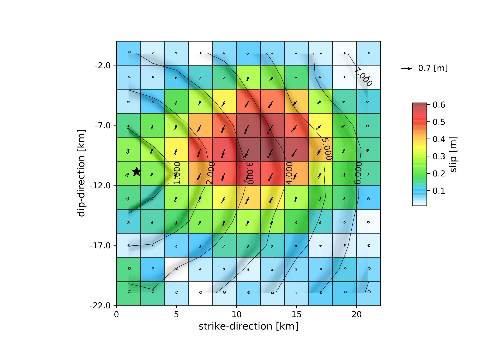
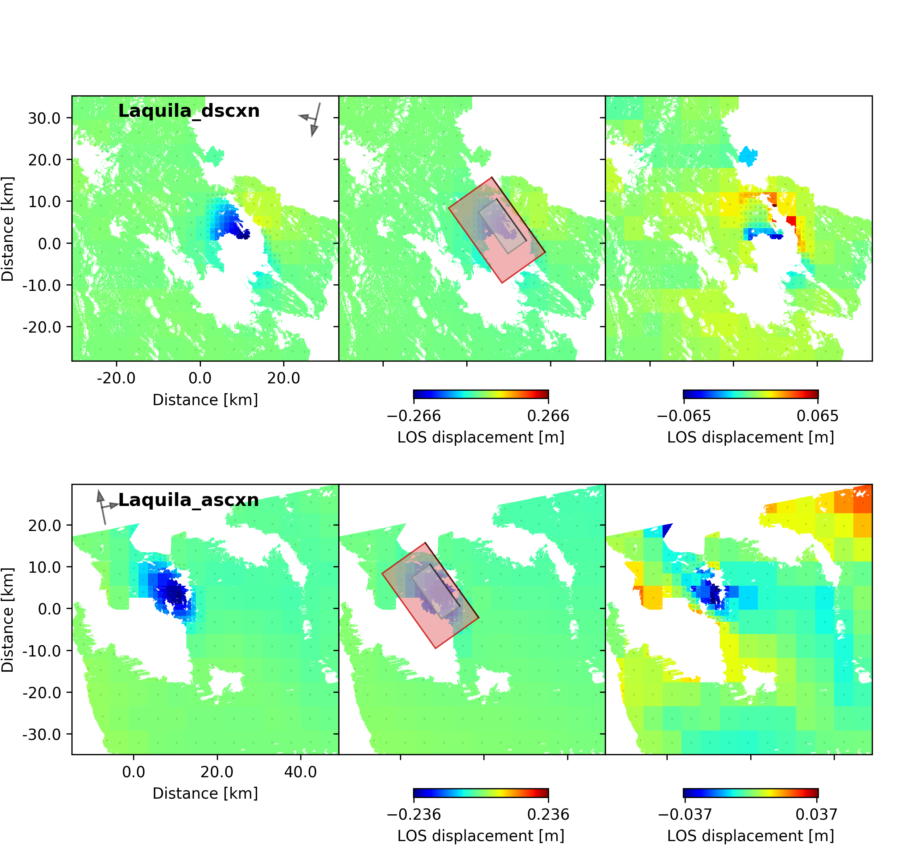
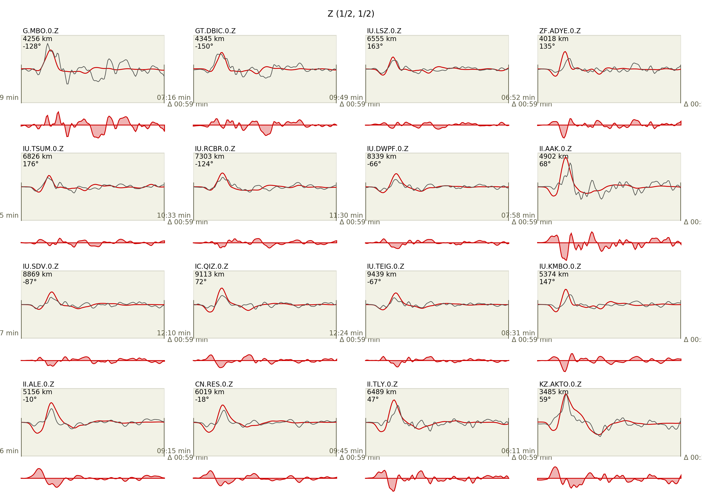
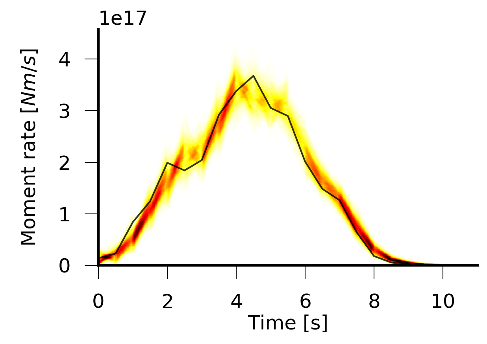

Example 4: kinematic finite-fault optimization
-------------------------------------------------

It is a requirement to have Example 2 and 3 completed in order to follow the instructions and commands given in this Example.
The data is the exact same from `Example 2 <https://hvasbath.github.io/beat/examples/Rectangular.html#>`__, where the overall geometry of the fault plane was estimated.
In `Example 3 <https://hvasbath.github.io/beat/examples/FFI_static.html#>`__ we solved for variable slip on the optimum fault geometry from Example 2 by using static InSAR data.
We will use the posterior marginals from Example 3 and use them as priors in this Example. Here we will determine a kinematic variable slip distribution including rupture propagation for the L'aquila 2009 earthquake by using static InSAR data **jointly** with teleseismic displacement waveforms.

Please make sure that you are one level above the Laquila project folder (created earlier).::

  cd $beat_models_path

Clone config
^^^^^^^^^^^^
We want to use the setup that we used for Example 3, but additionally we want to include the teleseismic data.
So we generate a new project folder Laquila_kinematic cloning the previous *config_ffi.yaml* from the *Laquila* project_directory with::

  beat clone Laquila Laquila_kinematic --mode=ffi --datatypes=geodetic,seismic

The new *config_ffi.yaml* will have an additional *seismic_config* and the *problem_config* includes priors for the kinematic rupture properties: velocities, durations, nucleation_strike, nucleation_dip, time as well as additional noise scalings for the seismic data in the hyperparameters.

Import results
^^^^^^^^^^^^^^
In this step we want to import the results from the previous two optimizations to the configuration file.
Firstly, we want to import the results from Example I(geometry optimization). But this time also the *seismic_config* is updated::

  beat import Laquila_kinematic --results=Laquila --mode=geometry --datatypes=geodetic,seismic

Now as we have two datatypes there are two *reference_sources* arguments in the config_ffi.yaml, one under *geodetic_config.gf_config* and another under *seismic_config.gf_config*. However, as you can see by the *yaml* coding (**id001**) these two are referring to the same object::

    ...
    gf_config: !beat.GeodeticLinearGFConfig
      store_superdir: /home/vasyurhm/GF/Laquila/
      reference_model_idx: 0
      n_variations: [0, 1]
      earth_model_name: ak135-f-continental.m
      nworkers: 4
      reference_sources:
      - &id001 !beat.sources.RectangularSource
        lat: 42.29
        lon: 13.35
        north_shift: 5542.073672733207
        east_shift: 10698.176839272524
        elevation: 0.0
        depth: 2926.702988951863
        time: 2009-04-06 01:32:49.190000
        stf: !pf.HalfSinusoidSTF
          duration: 0.0
          anchor: -1.0
        stf_mode: post
        strike: 144.48588106798306
        dip: 54.804317242125464
        rake: -114.58259929068664
        length: 12219.56636799338
        width: 9347.802691161543
        velocity: 3500.0
        slip: 0.5756726498300268
    ...
    gf_config: !beat.SeismicLinearGFConfig
      store_superdir: /home/vasyurhm/GF/Laquila/
      reference_model_idx: 0
      n_variations: [0, 1]
      earth_model_name: ak135-f-continental.m
      nworkers: 4
      reference_sources:
      - *id001
      patch_widths: [2.0]
      patch_lengths: [2.0]
      ...

Editing the *reference_sources* this way ensures consistent geometry for all datatypes (maybe in the future there are more to be added...).
Now please make sure that also the arguments *patch_widths* and *patch_lengths* as well as the *extension_widths* and *extension_lengths* are consistent!
The discretization at this point could be changed of course. However, this would then not allow to import the results from Example 3(ffi optimization), which we want to do next::

  beat import Laquila_kinematic --results=Laquila --mode=ffi --datatypes=geodetic,seismic

You will notice now that the lower and upper bounds of the slip parameters *uparr* and *uperp* have been updated. Each sub-patch has indiviudal bounds where the index in the array refers to the patch number in the geometry and discretization figure shown in Example 3. As a short recap here again.

.. image:: ../_static/example3/Laquila_FaultGeometry.png

.. note:: We could not reproduce the plot yet right away as we did not create the *fault_geometry.pkl* object yet.

Calculate Green's Functions
^^^^^^^^^^^^^^^^^^^^^^^^^^^
Elementary GFs
==============
Now the Green's Functions store(s) have to be calculated again for the "geometry" problem with higher resolutions. Please remember `Example I <https://hvasbath.github.io/beat/examples/Rectangular.html#calculate-greens-functions>`__. There the optimization was run using Green's Functions depth and distance sampling of 4km with 0.5Hz sampling. This may be accurate enough for the *geometry* type of optimization, however, for a finite fault optimization the aim is to resolve details of the rupture propagation and the slip distribution. So the setup parameters of the "geometry" Green's Functions would need to be changed to higher resolution. In this case we want to use wavelengths of up to 0.5Hz ergo a depth and distance sampling of 1 km and 2Hz sample rate may be precise enough. Of course, these parameters depend on the problem setup and have to be adjusted individually for each problem! So please open the *Laquila/config_geometry.yaml* and edit the parameters accordingly.
Running this calculation will take a long time depending on the number of CPUs at hand. (With 25 CPUs the calculation took approximately 15Hrs)::

  beat build_gfs Laquila --datatypes='seismic' --execute

Data windowing
^^^^^^^^^^^^^^
Now we need to decide on the post-processing parameters of the data and synthetics, i.e.:
 - which phase arrivals
 - which channels to use
 - bandpass filtering parameters
 - tapering- ergo time window around phase arrival  

We can adjust all these setting under the *wavemaps* listed in the *seismic_config.waveforms* attribute::

  waveforms:
  - !beat.WaveformFitConfig
    include: true
    preprocess_data: true
    blacklist: []
    name: any_P
    channels: [Z]
    filterer: !beat.heart.Filter
      lower_corner: 0.001
      upper_corner: 0.5
      order: 4
    distances: [30.0, 90.0]
    interpolation: multilinear
    arrival_taper: !beat.heart.ArrivalTaper
      a: -15.0
      b: -10.0
      c: 50.0
      d: 55.0 

Here we see that we use the *any_P* phase, i.e. P waves on the Z component (under *channels*), with a bandpass-filter between 0.001 and 0.5 Hz.
All the stations in a distance range of 30-90 degrees. If we wanted to throw out a station from the setup, we could write the station name in the *blacklist* as a string.
The data that is used for the posterior likelihood calculation is defined by the *arrival_taper* b and c value, i.e. here 10 seconds before and 50 seconds after the synthetic P-wave arrival (relative to the *event* location). 

All these values are fine for now- of course the user may change them as it pleases.

To inspect the filtered and tapered data that is being actually used in the optimization execute::

  beat check Laquila_kinematic --what=traces --mode=ffi

.. image:: ../_static/example4/datawindowing.png

The first two traces are the full unfiltered data in full length and the tapered filtered data as will be used in the optimization. If the user is not happy with one or the other parameters they can be adjusted and then the *beat check* command as above should be executed again until everything is set-up to the satisfaction of the user.

.. note:: The bandpass-filter and taper parameters will be used as well in the next step to calculate the *linear* Gfs.

GF Library
==========
In the next step again Green's Functions have to be calculated. What? Again? That's right! Now they need to be calculated for the fixed fault geometry (remember Example 3). Firstly, we create the discretized fault, this time for seismic and geodetic data::

  beat build_gfs Laquila_kinematic --datatypes=seismic,geodetic --mode=ffi

Parts of the output might look like::

    2018-11-03 15:28:00,164 - ffi.fault - INFO - Discretizing seismic source(s)
    2018-11-03 15:28:00,164 - ffi.fault - INFO - uparr slip component
    2018-11-03 15:28:00,164 - sources - INFO - Fault extended to length=22000.000000, width=22000.000000!
    2018-11-03 15:28:00,164 - sources - INFO - Fault would intersect surface! Setting top center to 0.!
    2018-11-03 15:28:00,165 - ffi.fault - INFO - Extended fault(s):
     --- !beat.sources.RectangularSource
    lat: 42.29
    lon: 13.35
    north_shift: 6741.193145771676
    east_shift: 12378.404380741504
    elevation: 0.0
    depth: 0.0
    time: 2009-04-06 01:32:49.19
    stf: !pf.HalfSinusoidSTF
      duration: 0.0
      anchor: -1.0
    stf_mode: post
    strike: 144.48588106798306
    dip: 54.804317242125464
    rake: -114.58259929068664
    length: 22000.0
    width: 22000.0
    velocity: 3500.0
    slip: 1.0

Here we see that due to the extension parameters got extended to 22.0 times 22.0 [km].

For the geodetic GF *library* these from the Laquila project_directory could be also copied/linked, but for now we just recalculate it.::

  beat build_gfs Laquila_kinematic --datatypes=geodetic --execute --mode=ffi

For the seismic GF *library* we need to specify temporal parameter bounds of the source(s).
As the forward calculation has to be as fast as possible as much as possible has to be pre-calculated. Therefore, the effects of the source-time-function on the waveforms has to be included in the *library*. The consequence is that we have a *library* that has additional dimensions for the possible source *durations* (risetimes) of each patch.

These can be specified for **all** the patches under the *durations* prior. In order to keep the *library* at feasable sizes these values should be reasonable compared to the size of the earthquake. Example: For a magnitude Mw 6 earthquake we do not expect risetimes of 20s...
Please set the lower and upper bounds of the durations to 0. and 4. seconds, respectively.

Also we need to specify the bounds on the rupture velocities. The shear-wave velocity from the velocity model is a good proxy for that. So please set the lower and upper bounds on the velocities to 2.2 and 4.5 [km/s], respectively. These velocities are sampled for each patch individually and indirectly determine the rupture onset time of each patch depending on the hypocentral location (*nucleation_dip* and *nucleation_strike*). To assure causal rupture propagation starting from the hypocentre the Eikonal equation is solved each forward calculation, which then determines the rupture onset time on each patch [Minson2013]_.

So far we defined everything with respect to the hypocentre, but we have to keep in mind that its location and the hypocentral time are unknowns as well. The time-shift with respect to the *event.time* has been determined in Example I before roughly assuming constant rupture velocity and uniform slip on the RectangularSource. Likely, the refined hypocentral time in this optimization will be converging to a similar time estimate as previously determined. This previously determined timing information has been imported as well in the "import results" - step. However, these bounds should be relaxed again as we are using different frequency content in the data and we allow for a much complexer optimization setup. Please set the lower and upper bounds for the *time* to -13. and 0., respectively.

Finally, we are left with specifying the *duration_sampling* and *starttime_sampling* under the *seismic_config.gf_config*. These determine the steps taken between the upper and lower bounds for the *durations* and the discrete starttime-shifts.
Please set the *duration_sampling* to 0.25. As we are using GFs with 2Hz setting the *starttime_sampling* to full discrete time samples of 0.5 is reasonable.

.. note::A duration sampling of 0.25 with a lower bound at 0. and an upper bound at 1. will result in source-time-function (STF) convolutions with the base-seismogram (no STF) at durations of [0., 0.25, 0.5, 0.75, 1.]. (for *each* patch and station). 

The *interpolation* attribute determines the interpolation method that is used to interpolate the GFs at values in between the pre-calculated waveforms. Please use *multilinear* for higher-precission and *nearest_neighbor* if the calculation has to be fast.

Now we are ready to calculate the seismic GF *library*. Depending on the priors and the number of CPUs (*nworkers* you want to specify under the *seismic_config.gf_config*) this calculation may take from few minutes to hour(s).::

  beat build_gfs Laquila_kinematic --datatypes=seismic --execute --mode=ffi

.. warning:: The seismic GF *libraries* can become very fast very big if the prior bounds are set too wide. These matrixes (two, i.e. one for each slip-component) have to be able to fit in the memory of your computer during sampling.

Like for the geodetic GFs this will create three files for each GF *library* in the **$linear_gfs** directory:
 - *seismic_uparr_static_0.traces.npy* a numpy array containing the linear GFs
 - *seismic_uparr_static_0.yaml* a yaml file with the meta information
 - *seismic_uparr_any_P_0.times.npy* a numpy array containing the start-times of each trace

For visual inspection of the resulting seismic traces in the "snuffler" waveform browser::

    beat check Laquila_kinematic --what='library' --datatypes='seismic' --mode='ffi'

This will load the seismic traces for the first station (target), for all patches, durations and starttimes.

.. image:: ../_static/example4/uparr_library_gf.png

Here we see the slip parallel traces for patch 0, at starttime (t0) of -1s (after the hypocentral source time wrt. the *event.time* (see time explanation above) and slip durations(tau) of 0. and 0.25[s].

Sample the solution space
^^^^^^^^^^^^^^^^^^^^^^^^^
Please refer to the 'Sample the solution space section' of `Example 1 <https://hvasbath.github.io/beat/examples/FullMT_regional.html#sample-the-solution-space>`__ Example for a more detailed description of the sampling and associated parameters.

Firstly, we only optimize for the noise scaling or hyperparameters (HPs) including the laplacian smoothing weight::

   beat sample Laquila_kinematic --hypers --mode=ffi

Checking the $project_directory/config_ffi.yaml, the hyperparameter bounds show something like::

   hyperparameters:
   h_SAR: !beat.heart.Parameter
     name: h_SAR
     form: Uniform
     lower: [-1.0]
     upper: [5.0]
     testvalue: [2.0]
   h_any_P_0_Z: !beat.heart.Parameter
     name: h_any_P_0_Z
     form: Uniform
     lower: [0.0]
     upper: [4.0]
     testvalue: [1.5]
   h_laplacian: !beat.heart.Parameter
     name: h_laplacian
     form: Uniform
     lower: [-5.0]
     upper: [5.0]
     testvalue: [0.5]

Markov Chain initialization
===========================
The *initialization* argument determines at which point in the solution space to initialize the Markov Chains. In Example 3 we set this argument to *lsq*.
Here we are going to use *random* again, please set it now! We initially narrowed down the slip-parameters by importing the results from Example 3. Thus, we already have a pretty good estimate on how the slip-distribution should look like, explaining the geodetic data reasonably well.

The 'n_jobs' number should be set to as many CPUs as the user can spare under the *sampler_config*. The number of sampled MarkovChains and the number of steps for each chain of the SMC sampler should be set to high values as we are optimizing now for ca 500 random variables (if the values from the tutorial haven't been altered by the user); for example to 8000 and 400, respectively.

.. warning:: With these sampler parameters a huge amount of samples are going to be stored to disk! Please see `Example 1 <https://hvasbath.github.io/beat/examples/FullMT_regional.html#summarize-the-results>`__ for an instruction on how to keep only the important samples to reduce the disk usage.

Finally, we are set to run the full optimization for the static slip-distribution with::

  beat sample Laquila_kinematic --mode=ffi

Summarize and plotting
^^^^^^^^^^^^^^^^^^^^^^
After the sampling successfully finished, the final stage results have to be summarized with::

 beat summarize Laquila_kinematic --stage_number=-1 --mode=ffi

After that several figures illustrating the results can be created.

For the kineamtic slip-distribution please run::

  beat plot Laquila_kinematic slip_distribution --mode=ffi

Compared to Example 3 we also see here the location of the hypocentre (black star) as well as the fuzzy rupture fronts based on the posterior ensemble of solutions.

To get histograms for the laplacian smoothing, the noise scalings, the hypocentral parameters and the posterior likelihood please run::

  beat plot Laquila_kinematic stage_posteriors --mode=ffi --force --stage_number=-1 --varnames=h_laplacian,h_any_P_0_Z,h_SAR,nucleation_dip,nucleation_strike,time,like

.. image:: ../_static/example4/stage_-1_max.png

For a comparison between data, synthetic displacements and residuals for the two InSAR tracks in a local coordinate system please run::

  beat plot Laquila_kinematic scene_fits --mode=ffi

The plot should show something like this. Here the residuals are displayed with an individual color scale according to their minimum and maximum values.

For a plot using the global geographic coordinate system where the residuals have the same color bar as data and synthetics please run::

  beat plot Laquila_kinematic scene_fits --mode=ffi --plot_projection=latlon

.. image:: ../_static/example4/scenes_-1_max_latlon_0.png

For the waveformfits::

  beat plot Laquila_kinematic waveform_fits --mode=ffi

For the fuzzy moment rate function::

  beat plot Laquila_kinematic moment_rate --mode=ffi

Here the MAP moment rate function is displayed by the black solid line.
