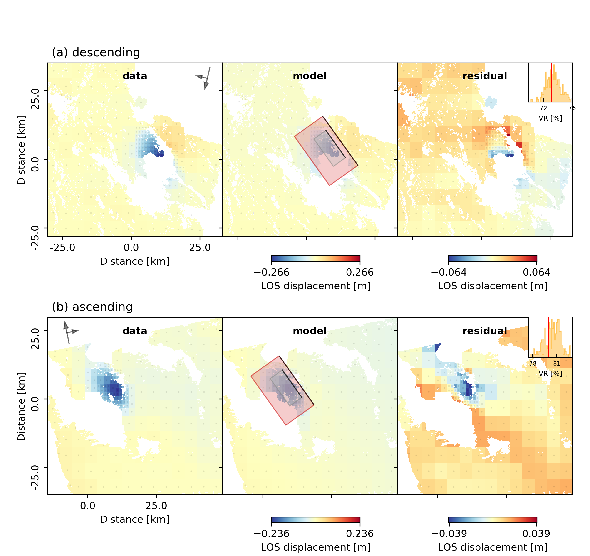
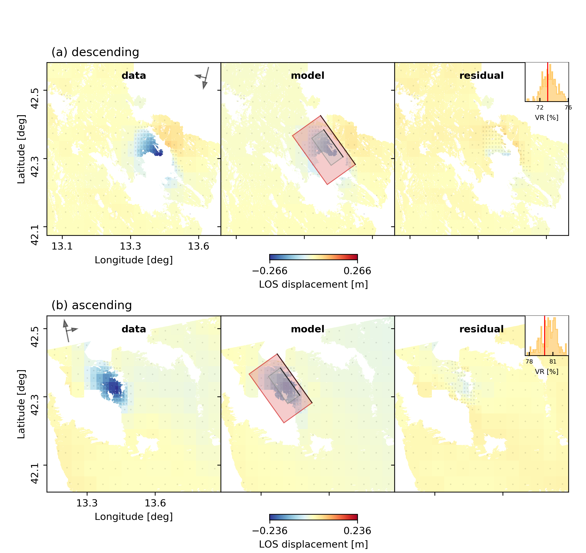

Example 4a: Static finite-fault estimation, uniform patch discretization
------------------------------------------------------------------------

In this example we will determine a variable slip distribution for the L'aquila 2009 earthquake by using static InSAR data.
We will use uniform discretization of fault patches across the fault surface.
The data is the exact same from `Example 3 <https://pyrocko.org/beat/docs/current/examples/Rectangular.html#>`__, where the overall geometry of the fault plane was estimated.
It is a requirement to have Example 3 completed in order to follow the instructions and commands given in this example.

Please make sure that you are one level above the Laquila project folder (created earlier).::

  cd $beat_models_path

Init
^^^^
In this example you will first make use of the **mode** argument. The default is: *geometry*, which is why it was not necessary to specify it in the earlier examples. Now we will always have to set **mode** to *ffi*, which is an abbreviation for finite-fault-inference.
The following command will create a configuration file for the *ffi* mode called *config_ffi.yaml* right next to the *config_geometry.yaml*::

  beat init Laquila --mode='ffi' --datatypes=geodetic

It will load the *config_geometry.yaml* and port arguments that have been specified before to ensure consistency and will only use *geodetic* data.

The main differences in the two configuration files are in the *geodetic_config.gf_config* and the *problem_config*. You may want to have a first glance at the new config. The general structure is the same and the argument names are chosen to give the user an initial idea what these are for. A short explanation for each argument is again given in the module API `here <https://pyrocko.org/beat/docs/current/api.html#config.NonlinearGFConfig>`__, where you can use the search function of your browser to find the argument of interest.

Calculate Greens Functions
^^^^^^^^^^^^^^^^^^^^^^^^^^
For the distributed slip optimization a reference fault has to be defined that determines the overall geometry.
Once this has been done the problem becomes linear as the only unknown parameters are the slips in rake perpendicular and rake parallel direction.
The fault geometry needs to be defined in the *geodetic.gf_config.reference_sources*.::

  gf_config: !beat.GeodeticLinearGFConfig
    store_superdir: /home/vasyurhm/GF/Laquila
    reference_model_idx: 0
    n_variations: [0, 1]
    earth_model_name: ak135-f-average.m
    nworkers: 4
    reference_sources:
    - !beat.sources.RectangularSource
      lat: 42.29
      lon: 13.35
      north_shift: 5542.073672733207
      east_shift: 10698.176839272524
      elevation: 0.0
      depth: 2926.702988951863
      time: 2009-04-06 01:32:49.19
      stf: !pf.HalfSinusoidSTF
        duration: 0.0
        anchor: 0.0
      stf_mode: post
      strike: 144.48588106798306
      dip: 54.804317242125464
      rake: -114.58259929068664
      length: 12219.56636799338
      width: 9347.802691161543
      velocity: 3500.0
      slip: 0.5756726498300268
    discretization: uniform
    discretization_config: !beat.UniformDiscretizationConfig
      extension_widths:
      - 0.6
      extension_lengths:
      - 0.4
      patch_widths:
      - 2.0
      patch_lengths:
      - 2.0
    sample_rate: 1.1574074074074073e-05

The values shown above are parts of the MAP solution from the optimization from `Example 3 <https://pyrocko.org/beat/docs/current/examples/Rectangular.html#>`__ . The results can been imported through the import command specifying the --results option. We want to import the results from the *Laquila* project_directory from an optimization in *geometry* mode and we want to update the *geodetic* part of the *config_ffi.yaml*::

  beat import Laquila --results=Laquila --mode='ffi' --datatypes=geodetic --import_from_mode=geometry

Of course, these values could be edited manually to whatever the user deems reasonable.

.. warning:: The reference point(s) on the *reference_fault(s)* are the top, central point of the fault(s)! Ergo the *depth* parameter(s) relate(s) to the **top edge(s)** of the fault(s).

Under the *discretization* attribute we can select the way of discretizing the fault surface into patches, now the default *uniform* is set. This attribute determines the *discretization_config* below. Here, we need to specify the dimensions of the patches we want to discretize the reference fault(s) into. The *patch_widths* and *patch_lengths* arguments have to be lists and the respective entry needs to result in **square** patches. The parameters **extension_withs** and **extension_lengths** specify by how much the reference fault(s) should be extended in **each** direction. Example: 0.1 means that the fault is extended by 10% of its width/length value in each direction and 0. means no extension.

Once we decided for the discretization and the reference fault values we can create the discretized fault through.::

  beat build_gfs Laquila --datatypes=geodetic --mode=ffi

This will create a directory (**$linear_gfs**): *Laquila/ffi/linear_gfs* where the fault geometry is saved as a pickle file 'fault_geometry.pkl'.
We can inspect the geometry of the resulting extended discretized fault wrt. the reference fault with::

  beat check Laquila --what=discretization --mode=ffi

This will open an interactive 3d plot of the fault geometry, which looks along the lines of

.. image:: ../_static/example4/Laquila_FaultGeometry.png

The grey rectangle shows the geometry of the fault specified under *reference_sources* and the red rectangle(s) show the extended fault with the respective discretization of the sub-patches. The grey and red dots mark the centres of the *reference_fault(s)* and the extended faults, respectively.
The numbers are the indexes of the repsective sub-patch in the Green's Function matrix we are going to calculate next.

.. note:: If the upper edge of the fault would intersect the surface (no topography assumed) due to the extension it is truncated at the intersection and not extended further. Which is why the extent of the red fault is asymmetric around the grey reference fault in dip-direction.

To repeat the fault discretization after changing some parameters please add the --force option and the previously fault geometry will be overwritten.::

  beat build_gfs Laquila --datatypes=geodetic --mode=ffi --force

The next command starts the calculation of the linear Green's Function matrixes (also called *library*) using *nworkers* CPUs in parallel with unit slip in each slip-direction.::

  beat build_gfs Laquila --datatypes=geodetic --mode=ffi --execute

.. note:: The slip components are not dip-slip and strike-slip, but rake-parallel (**uparr** in *config_ffi.yaml* priors) and rake-perpendicular (**uperp** in *config_ffi.yaml* priors) wrt to *reference_fault(s)* rake angle(s). This is following the convention of [Minson2013]_. In addition to that there is the component **utens**, which is normal to the previously mentioned components and would be needed to simulate tensile opening or closing. We ignore that here as we want to model a shear-dislocation.

This will create two files for each GF *library* in the **$linear_gfs** directory:
 - *geodetic_uparr_static_0.traces.npy* a numpy array containing the linear GFs
 - *geodetic_uparr_static_0.yaml* a yaml file with the meta information

Now we are ready to prepare the optimization setup.

Optimization setup
^^^^^^^^^^^^^^^^^^

Under the *problem_config* we find the parameters that we need to adjust::

    problem_config: !beat.ProblemConfig
      mode: ffi
      mode_config: !beat.FFIConfig
        regularization: none
        npatches: 121
        initialization: random
      source_types: [RectangularSource]
      stf_type: HalfSinusoid
      decimation_factors:
        geodetic: 1
        seismic: 1
      n_sources: [1]
      datatypes: [geodetic, seismic]
      hyperparameters:
        h_SAR: !beat.heart.Parameter
          name: h_SAR
          form: Uniform
          lower: [-20.0]
          upper: [20.0]
          testvalue: [0.0]
      priors:
        uparr: !beat.heart.Parameter
          name: uparr
          form: Uniform
          lower: [-0.05]
          upper: [6.0]
          testvalue: [1.15]
        uperp: !beat.heart.Parameter
          name: uperp
          form: Uniform
          lower: [-0.3]
          upper: [4.0]
          testvalue: [0.5]
        utens: !beat.heart.Parameter
          name: utens
          form: Uniform
          lower: [0.0]
          upper: [0.0]
          testvalue: [0.0]
      hierarchicals:
        Laquila_ascxn_azimuth_ramp: !beat.heart.Parameter
          name: Laquila_ascxn_azimuth_ramp
          form: Uniform
          lower:
          - -0.00043773457168120667
          upper:
          - -0.00043773457168120667
          testvalue:
          - -0.00043773457168120667
        Laquila_ascxn_offset: !beat.heart.Parameter
          name: Laquila_ascxn_offset
          form: Uniform
          lower:
          - -0.004496268249748271
          upper:
          - -0.004496268249748271
          testvalue:
          - -0.004496268249748271
        Laquila_ascxn_range_ramp: !beat.heart.Parameter
          name: Laquila_ascxn_range_ramp
          form: Uniform
          lower:
          - -0.00023808150002277328
          upper:
          - -0.00023808150002277328
          testvalue:
          - -0.00023808150002277328
        Laquila_dscxn_azimuth_ramp: !beat.heart.Parameter
          name: Laquila_dscxn_azimuth_ramp
          form: Uniform
          lower:
          - 4.978325480108451e-05
          upper:
          - 4.978325480108451e-05
          testvalue:
          - 4.978325480108451e-05
        Laquila_dscxn_offset: !beat.heart.Parameter
          name: Laquila_dscxn_offset
          form: Uniform
          lower:
          - -0.003754963750062188
          upper:
          - -0.003754963750062188
          testvalue:
          - -0.003754963750062188
        Laquila_dscxn_range_ramp: !beat.heart.Parameter
          name: Laquila_dscxn_range_ramp
          form: Uniform
          lower:
          - -0.00025072248953317104
          upper:
          - -0.00025072248953317104
          testvalue:
          - -0.00025072248953317104

.. note:: The npatches parameter should not be manually adjusted. It is automatically set by running the fault discretizeation step during GF calculation(above).

Hierarchicals
=============

Please notice the hierarchicals parameters! These are the MAP parameters for the orbital ramps for each radar scene that have been optimized in `Example 3 <https://pyrocko.org/beat/docs/current/examples/Rectangular.html#>`__ . These parameters are imported if the *ramp* correction under *corrections* in the *geodetic_config* was set to True.::

  corrections_config: !beat.GeodeticCorrectionsConfig
    euler_poles:
    - !beat.EulerPoleConfig
      enabled: false
    ramp: !beat.RampConfig
      dataset_names:
      - Laquila_dscxn
      - Laquila_ascxn
      enabled: true
    strain_rates:
    - !beat.StrainRateConfig
      enabled: false

The default is to fix these ramp parameters during the static distributed slip optimization, because leaving them open often results in tradeoffs with patches at greater depth and thus artificial slip is optimized at greater depth.
Nevertheless, the user may want to try out to free the upper and lower bounds again to include the parameters into the optimization.

..note:: The *EulerPole* and *StrainRate* corrections are useful for interseismic studies and will be covered in another tutorial.

Priors
======
The upper and lower bounds of the two prior variables can be adjusted to reduce the solution space (slip parameters [m]). For the L'aquila earthquake it is highly unlikely to have 6 meters of slip, which is simply the default parameter. A maximum slip of 2 meters in slip parallel direction may be more reasonable. In order to be able to sample the zero value at the lower bound it is necessary to allow for some backslip- ergo negative *uparr*; here 0.1 might be a reasonable choice.

To also allow for variable rake angles across the fault we may want to allow some rake perpendicular slip. Here the lower and upper bounds should be set to -1. and 1., respectively.

.. note:: In order to fix a variable at a certain value, the lower and upper bounds as well as the testvlue need to be set to the same value.

Regularization
==============

The *regularization* argument should be set to *laplacian* to introduce a smoothing constraint that penalizes high slip gradients between neighboring patches.
Once this is enabled we need to update the configuration file to initialize the slip-smoothing weight as a random variable in the optimization [Fukuda2008]_.
Adding the --diff option will display the changes to the config to screen instead of applying them to the file.::

  beat update Laquila --mode=ffi --diff --parameters=hypers

Once happy with the displayed changes the changes will be applied to the file with::

  beat update Laquila --mode=ffi --parameters=hypers

.. note:: The *None* regularization would be used if covariance matrices that describe the theory errors for the velocity model and/or the fault geometry have been estimated [Duputel2014]_ , [Ragon2018]_. How to do that in BEAT will be part of another tutorial in the future.

Sample the solution space
^^^^^^^^^^^^^^^^^^^^^^^^^
Please refer to the 'Sample the solution space section' of `example 3 <https://pyrocko.org/beat/docs/current/examples/FullMT_regional.html#sample-the-solution-space>`__ example for a more detailed description of the sampling and associated parameters.

Firstly, we only optimize for the noise scaling or hyperparameters (HPs) including the laplacian smoothing weight::

   beat sample Laquila --hypers --mode=ffi

Checking the $project_directory/config_ffi.yaml, the hyperparameter bounds show something like::

   hyperparameters:
   h_SAR: !beat.heart.Parameter
     name: h_SAR
     form: Uniform
     lower: [-1.0]
     upper: [5.0]
     testvalue: [2.0]
   h_laplacian: !beat.heart.Parameter
     name: h_laplacian
     form: Uniform
     lower: [-5.0]
     upper: [5.0]
     testvalue: [0.5]

Markov Chain initialization
===========================
The *initialization* argument determines at which point in the solution space to initialize the Markov Chains. The default value *random* simply draws a random point in the solution space from the prior distributions for each Markov Chain to be sampled. However, as we are using a laplacian smoothing constraint we can use the non-negative least-squares solution as a starting value for a randomly drawn smoothing weight (from the initial guess on the *h_laplacian* parameter range) [Fukuda2008]_. To do, so we need to set the *initialization* to "lsq"::

   mode_config: !beat.FFIConfig
     regularization: laplacian
     npatches: 121
     initialization: lsq

The 'n_jobs' number should be set to as many CPUs as the user can spare under the *sampler_config*. The number of sampled MarkovChains and the number of steps for each chain of the SMC sampler should be set to high values as we are optimizing now for ca 250 random variables (if the values from the tutorial haven't been altered by the user); for example to 5000 and 400, respectively.

.. warning:: With these sampler parameters a huge amount of samples are going to be stored to disk! With the values from the tutorial approximately *140GB* of samples are created in the course of the sampling. Please see `example 0 <https://hvasbath.github.io/beat/examples/FullMT_regional.html#summarize-the-results>`__ for an instruction on how to keep only the important samples to reduce the disk usage. Another way to reduce the required disc space is through the *buffer_thinning* parameter described `here <https://hvasbath.github.io/beat/getting_started/backends.html#sampling-backends>`__.

Finally, we are set to run the full optimization for the static slip-distribution with::

  beat sample Laquila --mode=ffi

Summarize and plotting
^^^^^^^^^^^^^^^^^^^^^^
After the sampling successfully finished, the final stage results have to be summarized with::

 beat summarize Laquila --stage_number=-1 --mode=ffi

After that several figures illustrating the results can be created.

For the slip-distribution please run::

  beat plot Laquila slip_distribution --mode=ffi

.. image:: ../_static/example4/Laquila_static_slip_dist_-1_max.png

To get histograms for the laplacian smoothing, the noise scalings and the posterior likelihood please run::

  beat plot Laquila stage_posteriors --stage_number=-1 --mode=ffi --varnames=h_laplacian,h_SAR,like

.. image:: ../_static/example4/stage_-1_max.png
   :height: 350px
   :width: 350 px

For a comparison between data, synthetic displacements and residuals for the two InSAR tracks in a local coordinate system please run::

  beat plot Laquila scene_fits --mode=ffi

The plot should show something like this. Here the residuals are displayed with an individual color scale according to their minimum and maximum values.

For a plot using the global geographic coordinate system where the residuals have the same color bar as data and synthetics please run::

  beat plot Laquila scene_fits --mode=ffi --plot_projection=latlon

References
^^^^^^^^^^
.. [Duputel2014] Duputel, Z., Agram, P. S., Simons, M., Minson, S. E., and Beck, J. L. (2014). Accounting for prediction uncertainty when inferring subsurface fault slip. Geophysical Journal International, 197(1):464–482
.. [Fukuda2008] Fukuda, J. and Johnson, K. M. (2008). A fully Bayesian inversion for spatial distribution of fault slip with objective smoothing. Bulletin of the Seismological Society of America, 98(3):1128–1146
.. [Ragon2018] Ragon, T., Sladen, A., Simons,  M. Accounting for uncertain fault geometry in earthquake source inversions – I: theory and simplified application, Geophysical Journal International, 214(2):1174–1190
