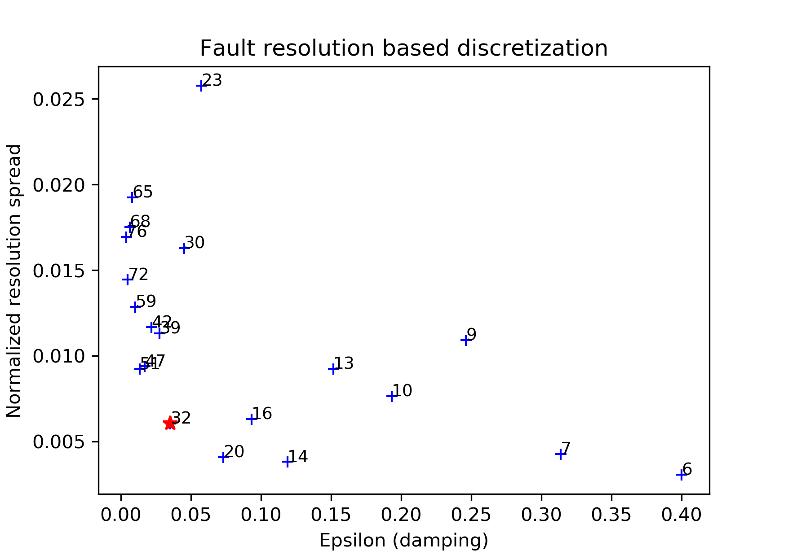
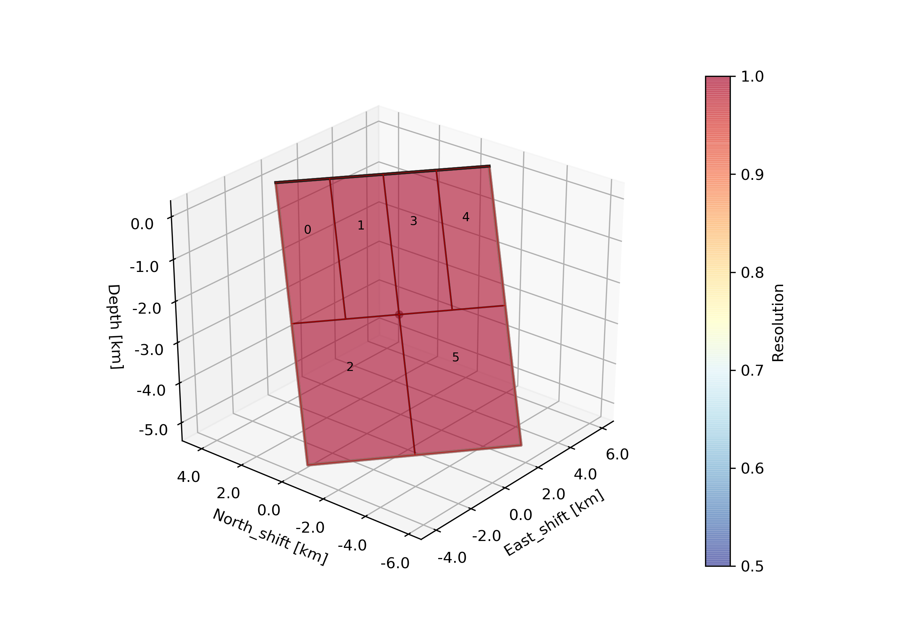
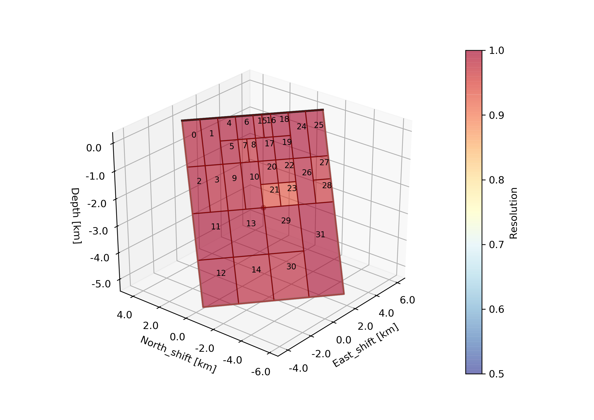
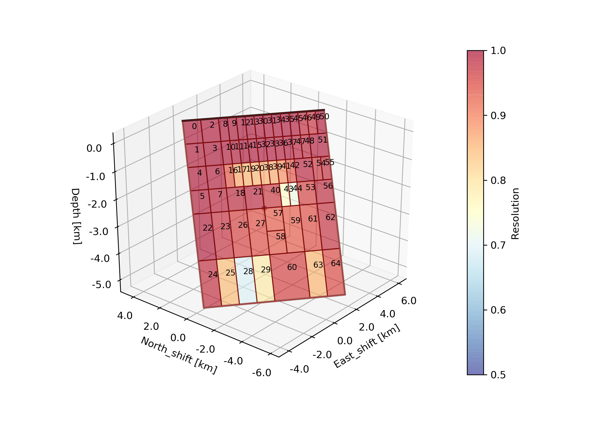
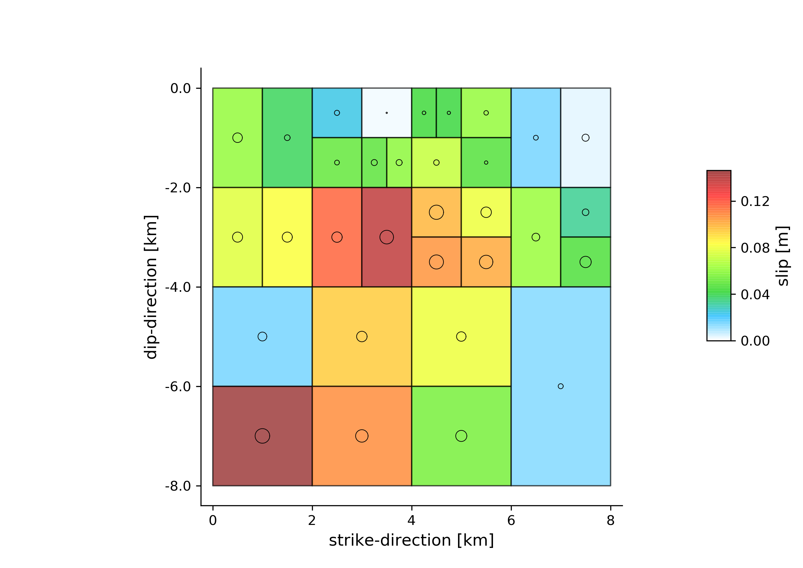
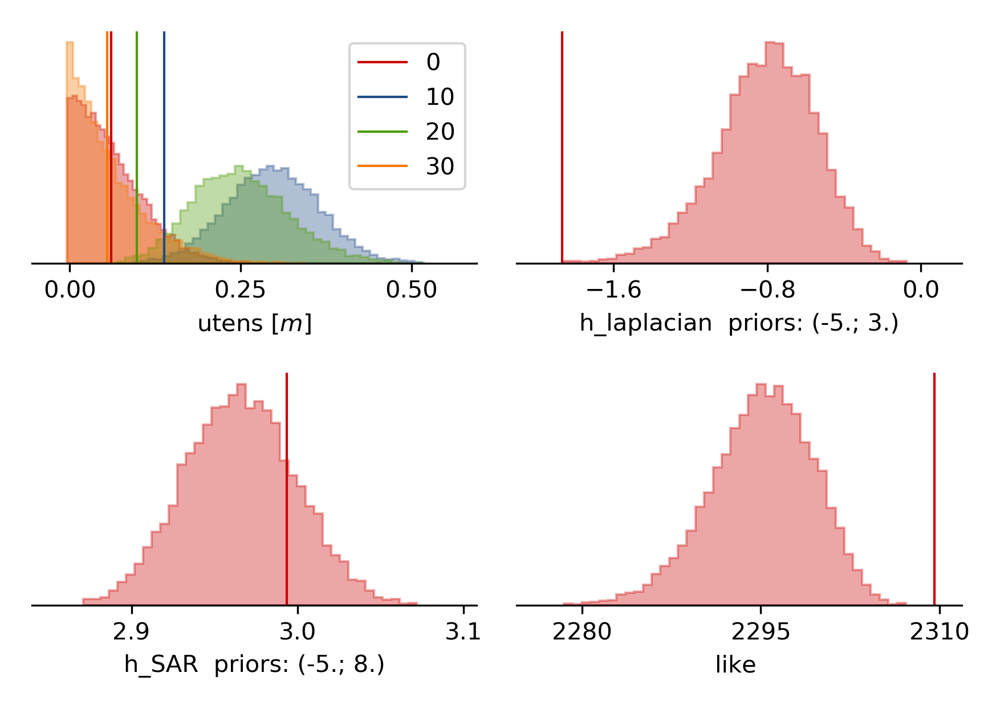
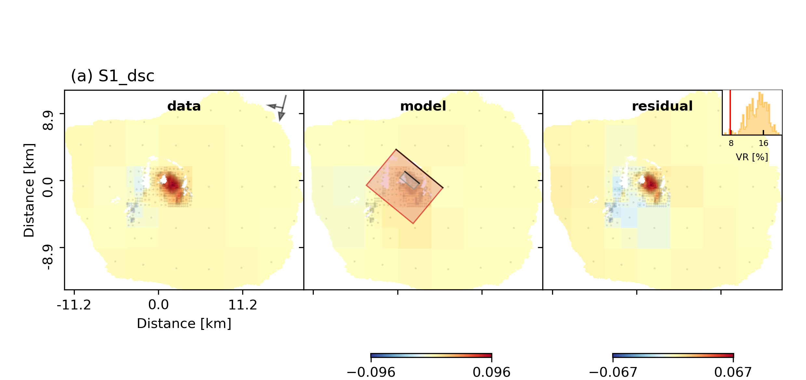
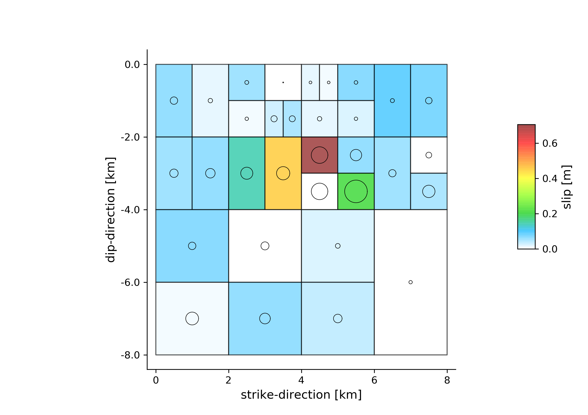
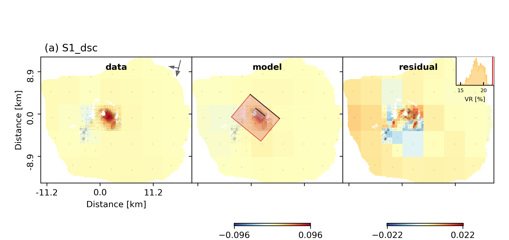
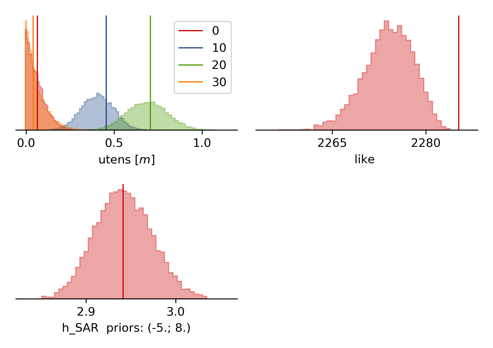

Example 7: Static tensile finite-fault inference, resolution based patch discretization
---------------------------------------------------------------------------------------

In this example we will determine a variable opening distribution for the magmatic intrusion at Fernandina during the time Dec 2014 - June 2018. This example
The data is the exact same from `Example 6 <https://pyrocko.org/beat/docs/current/examples/Rectangular_tensile.html>`__, where the overall geometry of the dike was estimated.
Here we use resolution based discretization of dividing the dike surface into smaller
patches following the approach of [Atzori2011]_. It is assumed that the reader has Example 6 completed before following this example.

Init
^^^^
In this example you will make use of the **mode** argument. The default is: *geometry*, which is why it was not necessary to specify it in the earlier example 6. Now we will always have to set **mode** to *ffi*, which is an abbreviation for finite-fault-inference.
The following command will create a configuration file for the *ffi* mode called *config_ffi.yaml* right next to the *config_geometry.yaml*::

  beat init Fernandina --mode='ffi' --datatypes=geodetic

It will load the *config_geometry.yaml* and port arguments that have been specified before to ensure consistency and will only use *geodetic* data.

The main differences in the two configuration files are in the *geodetic_config.gf_config* and the *problem_config*. You may want to have a first glance at the new config. The general structure is the same and the argument names are chosen to give the user an initial idea what these are for. A short explanation for each argument is again given in the module API `here <https://pyrocko.org/beat/docs/current/api.html#config.NonlinearGFConfig>`__, where you can use the search function of your browser to find the argument of interest.

Optimization setup
^^^^^^^^^^^^^^^^^^

To infer a tensile slip component instead of a shear slip component in BEAT, *priors* parameters
need to be adjusted. Users that are familiar with the variable shear slip inference on a fault
will not find many differences compared to such a scenario.
Under *priors* the *problem_config* we find the default parameters that we need to adjust.
The default is estimation of slip in rake parallel *uparr* and rake perpendicular *uperp* direction and no tensile *utens* slip.::

  priors:
    uparr: !beat.heart.Parameter
      name: uparr
      form: Uniform
      lower: [-0.05]
      upper: [6.0]
      testvalue: [1.15]
    uperp: !beat.heart.Parameter
      name: uperp
      form: Uniform
      lower: [-0.3]
      upper: [4.0]
      testvalue: [0.5]
    utens: !beat.heart.Parameter
      name: utens
      form: Uniform
      lower: [0.0]
      upper: [0.0]
      testvalue: [0.0]

This needs to be adjusted to sth like the following to enable the tensile slip and disable the shear slip components. (If we remember from earlier tutorials, a variable can be fixed by setting, *upper*, *lower* and *testvalue* fields to the same value, in our case zero)::

  priors:
    uparr: !beat.heart.Parameter
      name: uparr
      form: Uniform
      lower:
      - 0.0
      upper:
      - 0.0
      testvalue:
      - 0.0
    uperp: !beat.heart.Parameter
      name: uperp
      form: Uniform
      lower:
      - 0.0
      upper:
      - 0.0
      testvalue:
      - 0.0
    utens: !beat.heart.Parameter
      name: utens
      form: Uniform
      lower:
      - 0.0
      upper:
      - 3.0
      testvalue:
      - 0.4

.. note :: Mixed setups of tensile and shear-slip components is possible as well. The priors to each component need to be set accordingly, such that there is no zero fixed component.

.. warning :: The slip prior components need to be correctly configured prior to dike discretization, as these tell the discretization algorithm which slip components are present in the model setup! They have big impact on the outcome!!!

Calculate Greens Functions
^^^^^^^^^^^^^^^^^^^^^^^^^^
For the distributed opening estimation a reference dike has to be defined that determines the overall geometry. Once this has been done the problem becomes linear as the only unknown parameters are the openings rake normal direction. The dike geometry needs to be defined in the *geodetic.gf_config.reference_sources*.::

  gf_config: !beat.GeodeticLinearGFConfig
    store_superdir: /home/vasyurhm/BEATS/GF/Fernandina
    reference_model_idx: 0
    n_variations: [0, 1]
    earth_model_name: ak135-f-average.m
    nworkers: 4
    reference_sources:
    - !beat.sources.RectangularSource
       lat: -0.37
       lon: -91.55
       north_shift: 404.24607394505495
       east_shift: 1928.2854993240207
       depth: 1260.052918745202
       time: '1970-01-01 00:00:00'
       stf: !pf.HalfSinusoidSTF
         duration: 0.0
         anchor: -1.0
         exponent: 1
       stf_mode: post
       strike: 129.50797962980863
       dip: 39.46898718805227
       rake: 0.0
       length: 2438.6803420082388
       width: 1377.315426582522
       anchor: top
       velocity: 3500.0
       slip: 0.46930277548057164
       opening_fraction: 0.0
       aggressive_oversampling: false
    discretization: uniform
    discretization_config: !beat.UniformDiscretizationConfig
      extension_widths:
      - 0.1
      extension_lengths:
      - 0.1
      patch_widths:
      - 5.0
      patch_lengths:
      - 5.0
    sample_rate: 1.1574074074074073e-05

The values shown above are parts of the MAP solution from the inference from `Example 6 <https://pyrocko.org/beat/docs/current/examples/Rectangular_tensile.html>`__ . The results can been imported through the import command specifying the --results option. We want to import the results from the *Fernandina* project_directory from an inference in *geometry* mode and we want to update the *geodetic* part of the *config_ffi.yaml*::

  beat import Fernandina --results=Fernandina --mode='ffi' --datatypes=geodetic --import_from_mode=geometry

Of course, these values could be edited manually to whatever the user deems reasonable.

.. warning:: The reference point(s) on the *reference_fault(s)* are the top, central point of the fault(s)! Ergo the *depth* parameter(s) relate(s) to the **top edge(s)** of the fault(s).

Under the *discretization* attribute we can select the way of discretizing the fault surface into patches, now the default *uniform* is set.
However, in this example we want to discretize the fault surface using a resolution based discretization. Based on the reference fault/dike and the available data observations the model resolution matrix can be calculated and the fault/dike can be divided into patches such that a defined threshold of resolution is met. For details on the algorithm I refer the reader to the original article of [Atzori2011]_.

To use such an algorithm, please set the *discretization* attribute of the *gf_config* to *resolution* and run the update command to display changes to the config::

  beat update Fernandina --mode=ffi --diff

Rerun without --diff to apply the changes::

  beat update Fernandina --mode=ffi

The discretization config should look like this now::

    discretization: resolution
    discretization_config: !beat.ResolutionDiscretizationConfig
      extension_widths:
      - 0.1
      extension_lengths:
      - 0.1
      epsilon: 0.004
      epsilon_search_runs: 1
      resolution_thresh: 0.999
      depth_penalty: 3.5
      alpha: 0.3
      patch_widths_min:
      - 1.0
      patch_widths_max:
      - 5.0
      patch_lengths_min:
      - 1.0
      patch_lengths_max:
      - 5.0

The patch sizes will be iteratively optimized to be between the min and max values in length and width. Starting from large patches at *patch_widths_max* and *patch_lengths_max* they will be divided into smaller pieces until the patches are either smaller/equal than the defined *patch_widths_min* and *patch_lengths_min* or if the patches resolution is below the defined *resolution_thresh*. The *alpha* parameter determines how many of the patch candidates to be divided further, are actually divided in the next iteration (0.3 means 30%). The *epsilon* parameter here is most important in determining the final number of patches. The higher it is, the smaller the number of patches is going to be. The *depth_penalty* parameter is set to a reasonable value and likely does not need to be touched. The higher it is, the larger the patches that are at larger depth are going to be.

For the Fernandina case please set the following config attributes to:

=================== ======
   Attribute name    Value
=================== ======
    extension_width    0.1
   extension_length    0.1
            epsilon  0.004
epsilon_search_runs     20
              alpha    0.1
   patch_widths_min    0.5
   patch_widths_max    8.0
  patch_lengths_min    0.5
  patch_lengths_max    8.0
      depth_penalty    3.5
=================== ======

The *nworkers* attribute determines the number of processes to be run in parallel to calculate the Greens Functions and should be set to a sufficiently high number that the hardware supports (number of CPU -1).

With *epsilon_search_runs* we can control the number of models that
are run automatically with different *epsilon* parameters on a sensible search bound, starting with *epsilon* as the lowest.

We can start the discretization optimization with::

  beat build_gfs Fernandina --mode=ffi --datetypes=geodetic --execute --force --plot

.. note:: The --force option is needed to overwrite the previously discretized fault object that was copied during the clone command above. The object is implemented as *fault*, but it might be confusing as we want to infer parameters of a dike, which is nothing different than magma intruded along a crack in the host-rock. Consequently, a dike in BEAT is a fault with a tensile component.

The --plot option creates a plot of the discretized dike geometry (under Fernandina/ffi/figures) with the individual patch resolutions. The higher the resolution the better the opening can be resolved. Also it will generate following trade-off curve showing the model resolution spread vs. epsilon [Atzori2019]_. The black numbers indicate the corresponding number of patches.

The fault/dike at the elbow of the trade-off curve (red star) will then be selected to run the sampling (middle). Also we see an over- and under-damped case top and bottom, respectively.

As we do have irregular patch sizes we cannot use the *nearest_neighbor* *correlation_function* for the Laplacian, but we use a *gaussian* instead. Please edit the file accordingly! The *mode_config* should look like this::

  mode_config: !beat.FFIConfig
    regularization: laplacian
    regularization_config: !beat.LaplacianRegularizationConfig
      correlation_function: gaussian
    initialization: lsq
    npatches: 32
    subfault_npatches:
    - 32

.. warning:: The *npatches* and *subfault_npatches* argument were updated automatically and must not be edited by the user. These might differ slightly for the run of each user depending on the parameter configuration and as the discretization algorithm is not purely deterministic.

Manually selecting another fault discretizaion
^^^^^^^^^^^^^^^^^^^^^^^^^^^^^^^^^^^^^^^^^^^^^^
It might happen that the user favors another discretization, instead of the one selected by the algorithm. Please see `Example 4b <https://pyrocko.org/beat/docs/current/examples/FFI_static_resolution.html>`__ for how to select another discretization.

Sample
^^^^^^
Now the solution space can be sampled using following sampler configuration::

  sampler_config: !beat.SamplerConfig
    name: SMC
    backend: bin
    progressbar: true
    buffer_size: 5000
    buffer_thinning: 40
    parameters: !beat.SMCConfig
      tune_interval: 50
      check_bnd: true
      rm_flag: false
      n_jobs: 4
      n_steps: 400
      n_chains: 1000
      coef_variation: 1.0
      stage: 0
      proposal_dist: MultivariateCauchy
      update_covariances: false

.. note::  For more detailed search of the solution space please modify the parameters 'n_steps' and 'n_chains' for the SMC sampler in the $project_directory/config_ffi.yaml file to higher numbers. Depending on these specifications and the available hardware the sampling may take several hours. Further remarks regarding the configuration of the sampler can be found `here <https://pyrocko.org/beat/docs/current/getting_started/sampler_config.html#>`__ .

The sampling can be started with ::

  beat sample Fernandina --mode=ffi

Summarize and plotting
^^^^^^^^^^^^^^^^^^^^^^
After the sampling successfully finished, the final stage results have to be summarized with::

  beat summarize Fernandina --stage_number=-1 --mode=ffi

After that several figures illustrating the results can be created. To create all available plots
for the model setup run::

  beat plot Fernandina_nosmooth all --mode=ffi --stage_number=-1 --nensemble=300

The slip-distribution:

The histograms for the laplacian smoothing, the noise scalings and the posterior likelihood:

The comparison between data, synthetic displacements and residuals for the two InSAR tracks in a local coordinate system and a histogram of weighted variance reduction for a posterior model ensemble of 300 models:

The plot should show something like this. Here the residuals are displayed with an individual color scale according to their minimum and maximum values.

Now we notice that the variance reductions are significantly worse than the uniform slip results (~5%) and there are large correlated residuals left. The maximum slip (opening~tensile slip) values in the slip distribution (i.e. opening distribution) are much less than the uniform slip that was inferred in example 6. The reason for this is that the Laplacian smoothing in this case did not allow for a small patch with large opening as this would not be considered *"smooth"* in the model!!!

So we want to rerun the model without Laplacian smoothing. This is possible, because we optimized the sizes of each patch to be still resolvable by the data with the "full resolution" algorithm [Atzori2011]_, [Atzori2019]_ and we likely did not overparameterize the dikes surface.

Clone setup and repeat sampling
^^^^^^^^^^^^^^^^^^^^^^^^^^^^^^^

We do not want to throw away the previous result, but we want to keep (almost) the same model setup. So we clone the setup and the data into a new directory "Fernandina_nosmooth"::

  beat clone Fernandina Fernandina_nosmooth --mode=ffi --datatypes=geodetic --copy_data

To disable the laplacian smoothing we set the mode config to::

  mode_config: !beat.FFIConfig
    regularization: none
    initialization: lsq
    npatches: 32
    subfault_npatches:
    - 32

Now we rerun the new setup without smoothing, summarize and plotting::

  beat sample Fernandina_nosmooth --mode=ffi
  beat summarize Fernandina_nosmooth --stage_number=-1 --mode=ffi
  beat plot Fernandina_nosmooth all --mode=ffi --stage_number=-1 --nensemble=300

Now the datamisfits and opening distribution look much more reasonable:

References
^^^^^^^^^^
.. [Atzori2011] Atzori, S. and Antonioli, A. (2011).
    Optimal fault resolution in geodetic inversion of coseismic data
    Geophys. J. Int. (2011) 185, 529–538,
    `link <http://ascelibrary.org/doi: 10.1111/j.1365-246X.2011.04955.x>`__
.. [Atzori2019] Atzori, S.; Antonioli, A.; Tolomei, C.; De Novellis, V.;
    De Luca, C. and Monterroso, F.
    InSAR full-resolution analysis of the 2017–2018 M > 6 earthquakes in
    Mexico
    Remote Sensing of Environment, 234, 111461,
