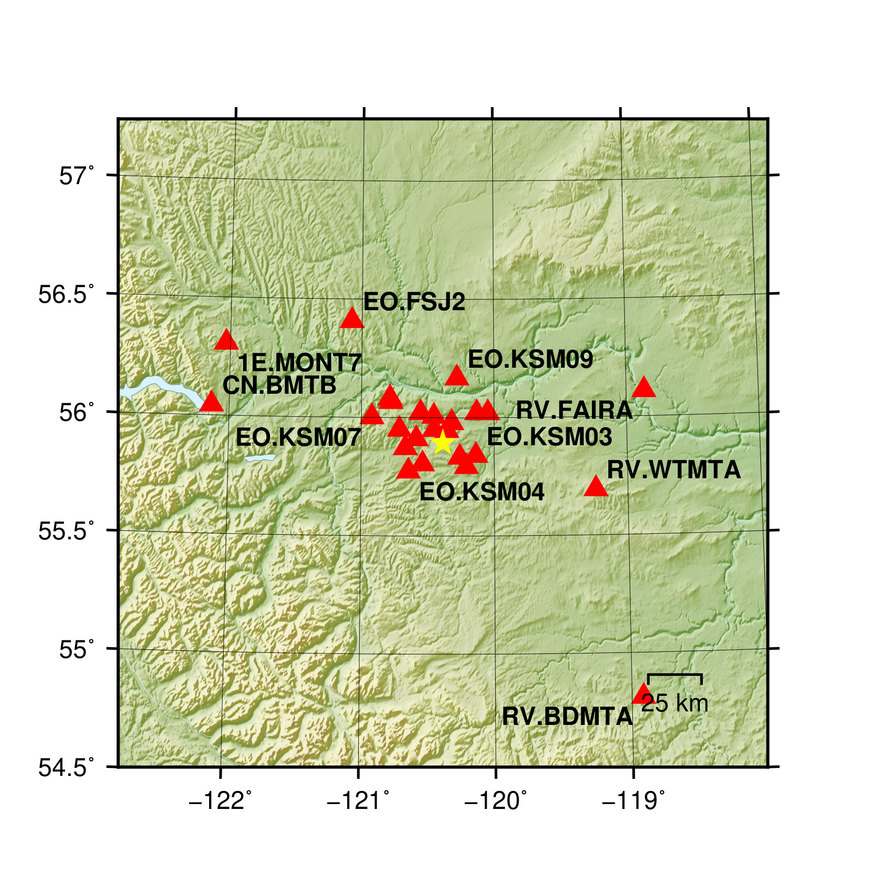
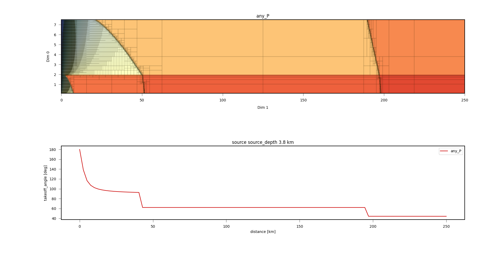
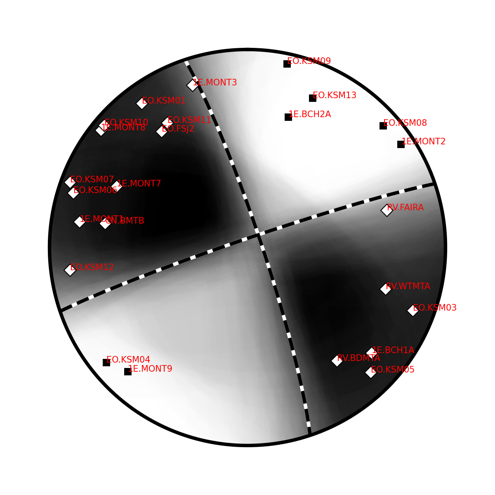
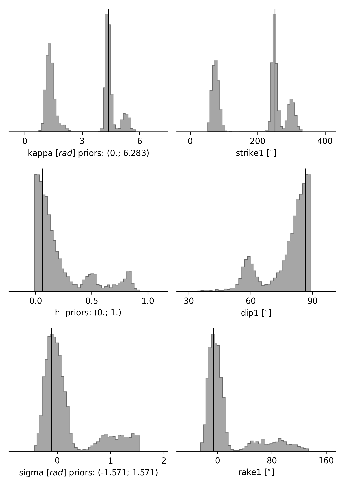
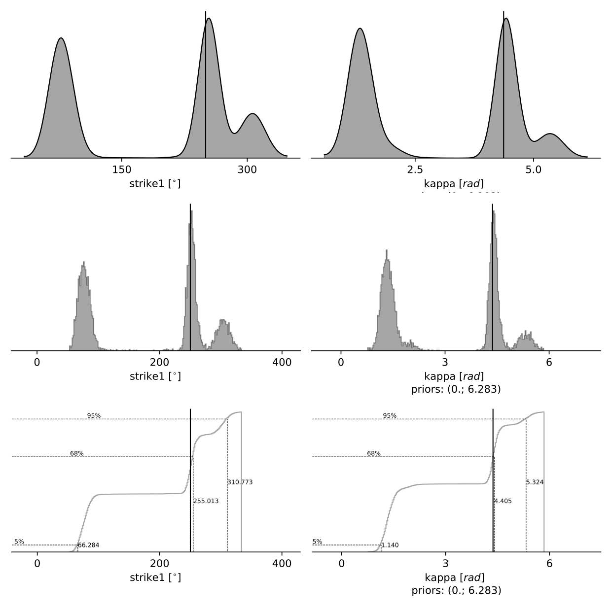
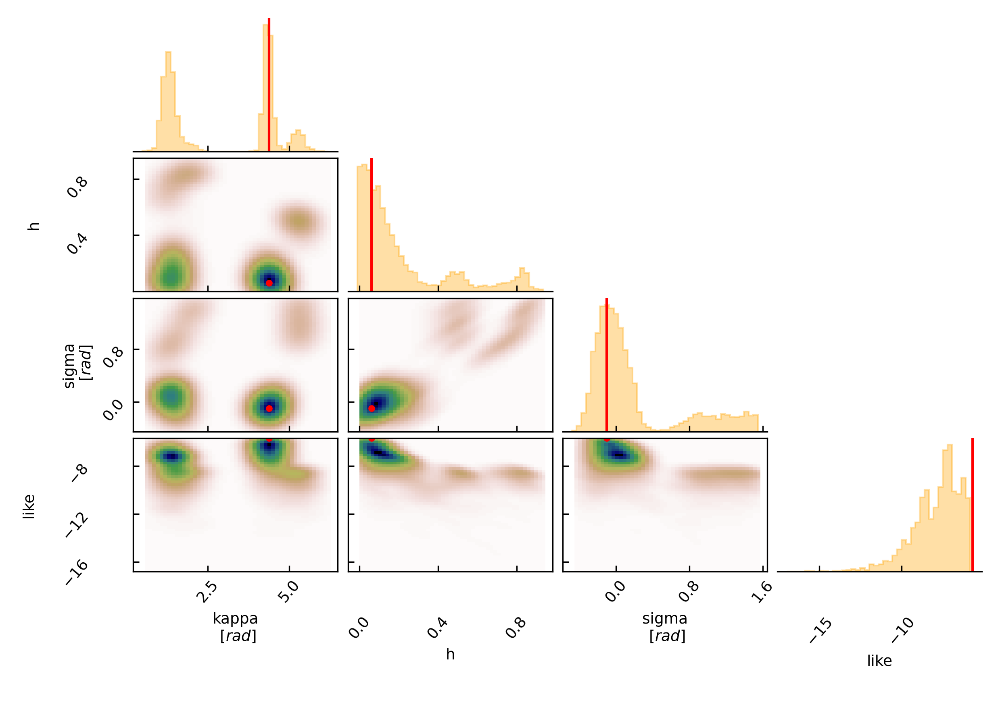

Example 8: Polarity: Regional DC Moment Tensor
----------------------------------------------
Clone project
^^^^^^^^^^^^^
This setup is comprised of 25 seismic stations in a distance range of 3 to 162 km with respect to a reference event occurred on 2021-03-11 with the
local magnitude of 1.6.
We will explore the solution space of a double couple Moment Tensor with the Tape and Tape 2015 parameterisation, the MTQTSource [TapeTape2015]_.
To copy the example setup (including the data) to a directory outside of the package source directory, please edit the *model path*
(referred to as $beat_models from now on) and execute::

    cd /path/to/beat/data/examples/
    beat clone MTQT_polarity /'model path'/MTQT_polarity --copy_data --datatypes=polarity

This will create a BEAT project directory named *MTQT_polarity* with a configuration file *config_geometry.yaml* and a file with information of the seismic stations *stations.txt*.
This directory is going to be referred to as *$project_directory* in the following.

Data formats
^^^^^^^^^^^^
The station information is loaded from a pyrocko `station file <https://pyrocko.org/docs/current/formats/basic_station.html>`__ (MTQT_polarity/stations.txt).

The polarity data format that BEAT uses are  `marker tables <https://pyrocko.org/docs/current/formats/snuffler_markers.html>`__ from the *snuffler* waveform browser. Please get familiar with the snuffler following its
`tutorial <https://pyrocko.org/docs/current/apps/snuffler/tutorial.html#snuffler-tutorial>`__ and especially, see the Marker
`tutorial <https://pyrocko.org/docs/current/apps/snuffler/tutorial.html#markers>`__ on how to create those markers and marker tables. The tables can then be saved through the snuffler menu with
*File > Save markers ...*. This example contains a polarity marker file named *polarity_markers_P.pf*. The path to this file needs to be specified under *polarities_marker_path*::

  polarity_config: !beat.PolarityConfig
    datadir: ./
    waveforms:
    - !beat.PolarityFitConfig
      name: any_P
      include: true
      polarities_marker_path: ./MTQT_polarity/polarity_markers_P.pf
      blacklist:
      - EO.KSM02
      - PQ.NBC7

Here, we can also blacklist specific stations (with the network.station code) for whatever reason, e.g. with erroneous polarities that we do not want to include in the inference.
The *name* field specifies the body wave the polarities are picked at. This can optionally be "any_SH" or "any_SV" for polarities picked at the horizontally or vertically polarized S-wave.

.. note:: For a joint inference of SH- and P wave polarities one would list several *PolarityFitConfig* blocks under the waveforms tab, like::

    polarity_config: !beat.PolarityConfig
      datadir: ./
      waveforms:
      - !beat.PolarityFitConfig
        name: any_P
        include: true
        polarities_marker_path: ./MTQT_polarity/polarity_markers_P.pf
        blacklist:
        - EO.KSM02
        - PQ.NBC7
      - !beat.PolarityFitConfig
        name: any_SH
        include: true
        polarities_marker_path: ./MTQT_polarity/polarity_markers_S.pf
        blacklist:
        - ''

  If seismic phases have been added, for which ray-tracing has not been done yet, the next step of GF calculation needs to be repeated.

Calculate Greens Functions
^^^^^^^^^^^^^^^^^^^^^^^^^^
For the inference of the moment tensor using polarity data the distances and takeoff-angles of rays from the seismic event towards stations need to be
calculated. This is dependent on the velocity model, the seismic phase and the source and receiver depth and distances. This information is stored
in databases called Greens Function (GF) store.

Please open $project_directory/config_geometry.yaml with any text editor (e.g. vi) and search for *store_superdir*. Here, it is written for
now ./MTQT_polarity, which is an example path to the directory of Greens Functions.
This path needs to be replaced with the path to where the GFs are supposed to be stored on your computer.
This directory is referred to as the $GF_path in the rest of the text. It is strongly recommended to use a separate directory
apart from the beat source directory and the $project_directory as the GF databases can become very large, depending on the problem!

In the $project_path/config_geometry.yaml under polarity config we find the gf_config, which holds the major parameters for GF calculation/raytracing::

  gf_config: !beat.PolarityGFConfig
    store_superdir: ./MTQT_polarity
    reference_model_idx: 0
    n_variations:
    - 0
    - 1
    earth_model_name: local
    nworkers: 4
    use_crust2: false
    replace_water: false
    custom_velocity_model: |2
          0.             3.406          2.009          2.215        331.1          147.3
          1.9            3.406          2.009          2.215        331.1          147.3
          1.9            5.545          3.295          2.609        286.5          127.5
          8.             5.545          3.295          2.609        286.5          127.5
          8.             6.271          3.74           2.781        471.7          210.1
         21.             6.271          3.74           2.781        471.7          210.1
         21.             6.407          3.767          2.822        900.           401.6
         40.             6.407          3.767          2.822        900.           401.6
    source_depth_min: 0.1
    source_depth_max: 7.5
    source_depth_spacing: 0.1
    source_distance_radius: 250.0
    source_distance_spacing: 0.1
    reference_location: !beat.heart.ReferenceLocation
      lat: 55.89310323984567
      lon: -120.38565188644934
      depth: 1.65
      station: polarity
    error_depth: 0.1
    error_velocities: 0.1
    depth_limit_variation: 600.0
    code: cake
    always_raytrace: True

Here we see that instead of a global velocity model a *custom_velocity_model* is going to be used for all the stations.::

    cd $beat_models
    beat build_gfs MTQT_polarity --datatypes='polarity'

This will create an empty Greens Function store named PolarityTest_local_1.000Hz_0 under the $GF_path. Under $GF_path/polarity_local_1.000Hz_0/config
it is recommended to cross-check again the velocity model and the specifications of the store (open with any texteditor).

Continuing with this example the user has two options to continue. It is recommended to first continue with option 1.
If the inference has been successfully completed with option 1, the user may proceed and try option 2.

Option 1: Fixed location - Raytracing of raypaths
=================================================

When the event location is not of interest and fixed a priori or when ray-paths are complicated and takeoff-angle
interpolation would be inaccurate, it can be useful to rely on repeated ray-tracing instead of calculating the interpolation tables.
We can force this behavior by setting.::

    always_raytrace: True

In this case only the *custom_velocity_model* is of interest. We will create with the following command a dummy GF store that still holds information
of the velocity model and the seismic phases to use for the ray-tracing. In case, something has been changed in the setup the store configuration
files have to be updated. We can do this with the --force option; --execute will finalize this step.::

    beat build_gfs MTQT_polarity --datatypes='polarity' --force --execute

We can also plot the station map with::

  beat plot MTQT_polarity station_map

Please continue the tutorial under optimization setup.

Option 2: Unknown location - Pre-calculate interpolation tables
===============================================================
BEAT supports the estimation of the location of the event, which requires repeated ray tracing. In order to avoid repeated ray-tracing,
we pre-calculate look-up interpolation tables of the takeoff-angles based on a grid of potential source depths and distances towards the stations.

We can force this behavior by setting.::

    always_raytrace: False

Below are the grid definitions of the GFs.::

    source_depth_min: 0.1
    source_depth_max: 7.5
    source_depth_spacing: 0.1
    source_distance_radius: 250.0
    source_distance_spacing: 0.1
    reference_location: !beat.heart.ReferenceLocation
      lat: 55.89310323984567
      lon: -120.38565188644934
      depth: 1.65
      station: polarity

The distance is measured between the *ReferenceLocation* and each seismic station. These grid sampling parameters are of major importance for the
accuracy of interpolated takeoff-angels. For specific event-station setups the *distance_spacing* and *depth_spacing* parameters may not be
accurate enough. In this case BEAT will warn the user and will ask the user to lower these values.

For our use-case the grid specifications are fine for now. In this case the takeoff-angles are going to be calculated for the P body waves.#
Now the store configuration files have to be updated. As we created them before we need to overwrite them! We can do this with the --force option;
--execute will start the actual calculation.::

    beat build_gfs MTQT_polarity --datatypes='polarity' --force --execute

Now we can inspect the calculated takeoff-angle table ::

  cd $store_superdir
  fomosto satview polarity_local_10.000Hz_0 any_P

The top plot shows depth vs distance and the respective takeoff-angle in color. The black boxes are adaptively calculated based on the gradient of takeoff-angles, where grid points falling into one box have the same takeoff-angles.
Thus, we see that at close distances we have small boxes i.e. rapidly changing takeoff-angles, which is not the case for larger distances. Just at rays close to velocity model layer changes these become finer again.

The lower plot shows the takeoff-angle at the depth of 3.8km for all the distances, i.e. a horizontal profile through the top plot.

.. note:: The inference may still be run on free location using *always_raytrace: False*, but sample times will be higher due to repeated ray-tracing.

Optimization setup
^^^^^^^^^^^^^^^^^^

For this setup we use the moment tensor parameterisation of the MTQTSource after [TapeTape2015]_.
This is defined in the *problem_config* (source specification)::

  problem_config: !beat.ProblemConfig
    mode: geometry
    source_type: MTQTSource
    stf_type: Triangular
    n_sources: 1
    datatypes:
    - polarity

Finally, we need to configure *priors* and *hyperparameters*::

  hyperparameters:
    h_any_P_pol_0: !beat.heart.Parameter
      name: h_any_P_pol_0
      form: Uniform
      lower:
      - 0.05
      upper:
      - 0.05
      testvalue:
      - 0.05
  priors:
    depth: !beat.heart.Parameter    # [km]
      name: depth
      form: Uniform
      lower:
      - 5.0
      upper:
      - 5.0
      testvalue:
      - 5.0
    east_shift: !beat.heart.Parameter    # [km]
      name: east_shift
      form: Uniform
      lower:
      - 0.0
      upper:
      - 0.0
      testvalue:
      - 0.0
    h: !beat.heart.Parameter        # source dip
      name: h
      form: Uniform
      lower:
      - 0.0
      upper:
      - 1.0
      testvalue:
      - 0.2
    kappa: !beat.heart.Parameter    # source strike [rad]
      name: kappa
      form: Uniform
      lower:
      - 0.0
      upper:
      - 6.283185307179586
      testvalue:
      - 1.2566370614359172
    north_shift: !beat.heart.Parameter    # [km]
      name: north_shift
      form: Uniform
      lower:
      - 0.0
      upper:
      - 0.0
      testvalue:
      - 0.0
    sigma: !beat.heart.Parameter      # source rake [rad]
      name: sigma
      form: Uniform
      lower:
      - -1.5707963267948966
      upper:
      - 1.5707963267948966
      testvalue:
      - -1.2566370614359172
    w: !beat.heart.Parameter        # Defined: -3/8pi <= w <=3/8pi. "
      name: w                       # If fixed to zero the MT is deviatoric.
      form: Uniform
      lower:
      - 0.0
      upper:
      - 0.0
      testvalue:
      - 0.0
    v: !beat.heart.Parameter      # Defined: -1/3 <= v <= 1/3. "
      name: v                     # If fixed to zero together with w the MT is pure DC.
      form: Uniform
      lower:
      - 0.0
      upper:
      - 0.0
      testvalue:
      - 0.0

*Hyperparameters* are hierarchical noise scalings for the dataset, while the *priors* define the search space for the sampler.
The *priors* h, kappa, sigma, w, and v are specific source parameters of the MTQTSource. When fixing the parameter *v* and *w* to zero, by
setting the *lower* the *upper* and *testvalue* to zero, the MT is purely double-couple. These can be extended to their defined bounds (see comments
above) to enable the full MT inversion. The other MTQTSource parameters are recommended to remain untouched as this would pre-constrain and bias
the solution.

Option 1: Fixed location
========================
Nothing else needs to be adjusted, as the location parameters, *depth*, *east_shift* and *north_shift* are fixed.

Option 2: Unknown location
==========================
Please extend the *lower* and *upper* bounds for the *east_shift* and *north_shift* parameters to -10 and 10, respectively. Please also set the
bounds for *depth* to 0.5 and 7.0.

.. warning:: The lower and upper bounds of the *depth* parameter must not exceed the *source_depth_min* and *source_depth_max* of the GF store. In case larger depths are required the takeoff-angle tables need to be recalculated.

The hierarchical noise scaling is fixed to a low number for simplicity.
Now that we checked the optimization setup we are good to go.

Sample the solution space
^^^^^^^^^^^^^^^^^^^^^^^^^

Now we can run the inference using the likelihood formulation for polarity data after [Brillinger1980]_ and the default sampling algorithm,
a Sequential Monte Carlo sampler. The sampler can effectively exploit the parallel architecture of nowadays computers.
The *n_jobs* number should be set to as many CPUs as possible in the configuration file.::

  sampler_config: !beat.SamplerConfig
    name: SMC
    backend: bin
    progressbar: true
    buffer_size: 1000
    buffer_thinning: 10
    parameters: !beat.SMCConfig
      tune_interval: 50
      check_bnd: true
      rm_flag: false
      n_jobs: 4
      n_steps: 200
      n_chains: 300
      coef_variation: 1.0
      stage: 0
      proposal_dist: MultivariateCauchy
      update_covariances: false

.. note:: *n_chains* divided by *n_jobs* MUST yield a *Integer* number! An error is going to be thrown if this is not the case!

Here we use 4 cpus (n_jobs) - you can change this according to your systems specifications.
Finally, we sample the solution space with::

    beat sample MTQT_polarity

Summarize the results
^^^^^^^^^^^^^^^^^^^^^
The sampled chain results of the SMC sampler are stored in separate files and have to be summarized.
To summarize the final stage of the sampler please run the summarize command.::

    beat summarize MTQT_polarity --stage_number=-1 --calc_derived

.. note:: The --calc_derived option transforms the parameters from the MTQT source to standard NEED moment tensor components, which is needed for the plotting later.

If the final stage is included in the stages to be summarized also a summary file with the posterior quantiles will be created.
If you check the summary.txt file (path then also printed to the screen)::

    vi $project_directory/geometry/summary.txt

For example for the first 4 entries (h, kappa, sigma, polarity likelihood for first station), the posterior pdf quantiles show::

                        mean        sd  mc_error    hpd_0.5  hpd_99.5
  h__0               0.220287  0.239182  0.014327   0.000016  0.869736
  kappa__0           3.071605  1.620180  0.120186   0.929092  5.625192
  sigma__0           0.211455  0.503355  0.030465  -0.353681  1.548014
  polarity_like__0  -0.248045  0.135806  0.003524  -1.021561 -0.223144

Plotting
^^^^^^^^
To see results of the source inference based on polarity, we can plot the source radiation pattern (beachball) with the ray-piercing points at
seismic stations and the respective polarities on it. The *nensemble* argument would add uncertainty to the plot.::

    beat plot MTQT_polarity fuzzy_beachball --nensemble=300 --stage_number=-1

The following command produces a '.png' file with the final posterior distribution. In the $beat_models run::

    beat plot MTQT_polarity stage_posteriors --stage_number=-1 --format='png' --varnames=kappa,h,sigma,strike1,dip1,rake1

It may look like this.

The vertical black lines are the true values and the vertical red lines are the maximum likelihood values.

The posterior marginals can be plotted using different forms, either "kde", "pdf", or "cdf" through the option *--plot_projection*::

    beat plot MTQT_polarity stage_posteriors --stage_number=-1 --format='png' --varnames=strike1,kappa --plot_projection=kde

Repeatedly calling the above commandline and combining the output yields following figure, from top to bottom: with varying *--plot_projection* kde, pdf, cdf.

To get an image of parameter correlations (including the maximum aposterior (MAP) value in red) of moment tensor components and posterior likelihood.::

    beat plot MTQT_polarity correlation_hist --stage_number=-1 --format='png' --varnames='kappa,h,sigma,like'

This will show an image like that.

This shows 2d kernel density estimates (kde) and histograms of the specified model parameters. The darker the 2d kde the higher the probability
of the model parameter.

The *varnames* option may take any parameter that has been optimized for. For example one might also want to try (option 2) --varnames='h,sigma,kappa,north_shift,east_shift,depth'.
If it is not specified all sampled parameters are taken into account.

Clone setup into new project
^^^^^^^^^^^^^^^^^^^^^^^^^^^^
Now we want to repeat the sampling with the free location, but we want to keep the previous results
as well as the configuration files unchanged for keeping track of our work. So we can use the clone function to clone
the current setup into a new directory.::

  beat clone MTQT_polarity MTQT_polarity_loc --copy_data --datatypes=polarity

Now, we can repeate the steps following option 2 starting at Greens Function calculations always using *MTQT_polarity_loc* as the $project_path.

References
^^^^^^^^^^
.. [TapeTape2015] A uniform parametrization of moment tensors. Geophysical Journal International, 202(3), 2074–2081. https://doi.org/10.1093/gji/ggv262
.. [Brillinger1980] Brillinger, D. R. and Udias, A. and Bolt, B. A., A probability model for regional focal mechanism solutions. Bulletin of the Seismological Society of America 1980: doi: https://doi.org/10.1785/BSSA0700010149
