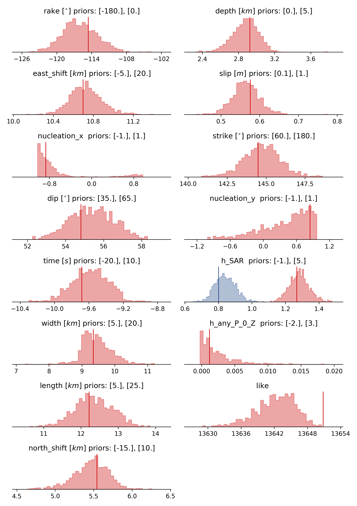
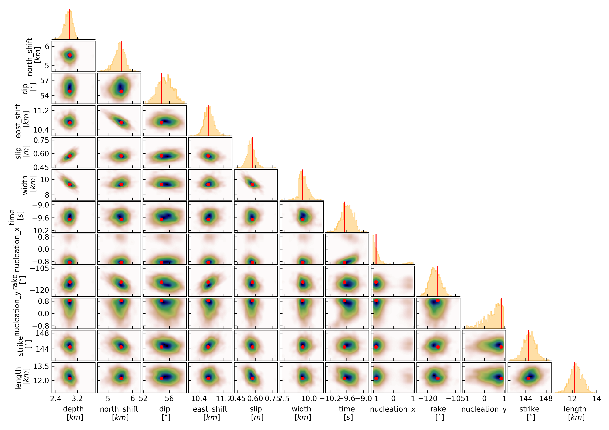

Example 3: Rectangular source
-----------------------------
In this example we will explore the parameter space of a Rectangular Source [Okada1985]_ for the L'aquila 2009 earthquake.
It is up to the user to decide, which data is going to be used in the optimization, teleseismic waveforms and/or geodetic data.

The geodetic data consists of two static displacements data sets from the 06.04.2009 Mw6.3 L'Aquila earthquake. The data are InSAR displacement maps from ascending
and descending orbits.
The data has been pre-processed with `kite <https://github.com/pyrocko/kite>`__. For details on the use and data display we refer to the tutorial on the website.

.. image:: ../_static/example3/Laquila_asc.png

The seismic data consists of teleseismic waveforms of 35 stations that have been restituted to displacement, rotated to RTZ and downsampled to 2.5 Hz.

Clone project
^^^^^^^^^^^^^

To copy the example (including the data) to a directory outside of the package source directory, please edit the '&beat_models_path' and depending on which datatypes you want to use in the optimization fill the datatypes argument. For both datatypes (if only selected datatypes are of interest please delete either)::

   cd /path/to/beat/data/examples/
   beat clone Laquila $beat_models_path/Laquila --datatypes=seismic,geodetic --copy_data

This will create a BEAT project directory named 'Laquila' with a configuration file (config_geometry.yaml) and an example dataset.
 - If your datatypes list included "geodetic" real Envisat InSAR data (geodetic_data.pkl) will be copied.
 - If "seismic" was included in the datatypes list, teleseismic waveforms, real data from 35 stations will be copied to seismic_data.pkl

Please change to your &beat_models_path with::

   cd $beat_models_path

Calculate Greens Functions
^^^^^^^^^^^^^^^^^^^^^^^^^^
We need to calculate a Greens function (GF) store, as done in `Example 1 <https://hvasbath.github.io/beat/examples.html#calculate-greens-functions>`__
the regional Full Moment Tensor example.
Depending on the datatypes you selected earlier you will have to calculate the Greens Functions for both or either datatypes.

Geodetic
========
In this case we will calculate a Greens Function store that holds static displacements. For this we will make use of the PSGRN/PSCMP [Wang2008]_ backend.
You will need to install the respective executables if not done yet! Please follow this `link <https://hvasbath.github.io/beat/installation.html#greens-functions>`__ to do so.

Please open $project_directory/config_geometry.yaml with any text editor (e.g. vi) and search for: store_superdir.
The path specified here needs to be replaced with the path to where the GFs are supposed to be stored on your computer.
This directory is referred to as the $GF_path in the rest of the text. It is strongly recommended to use a separate directory
apart from the beat source directory. The statics Green's function stores are not very large, but could be re-used by several projects in the
future.

In the $project_path/config_geometry.yaml under geodetic_config we find the gf_config, which holds the major parameters for GF calculation::

 gf_config: !beat.GeodeticGFConfig
   store_superdir: $project_directory/
   reference_model_idx: 0
   n_variations: [0, 1]
   earth_model_name: ak135-f-continental.m
   nworkers: 6
   use_crust2: false
   replace_water: false
   source_depth_min: 0.0
   source_depth_max: 35.0
   source_depth_spacing: 1.0
   source_distance_radius: 100.0
   source_distance_spacing: 1.
   error_depth: 0.1
   error_velocities: 0.1
   depth_limit_variation: 600.0
   code: psgrn
   sample_rate: 1.1574074074074073e-05
   sampling_interval: 1.0
   medium_depth_spacing: 1.0
   medium_distance_spacing: 1.0

To get a short explanation for each parameter please see the API modules `here <https://hvasbath.github.io/beat/api.html#config.NonlinearGFConfig>`__.

The variable 'store_superdir' needs to contain an **absolute path** to your $project_directory/.
You can also change the number of cores available to your system with the variable 'nworkers' to speed up the calculation of the GFs.
The GF grid spacing is important and can be modified in x,y direction with 'source_distance_spacing' and in depth with 'source_depth_spacing'.
The grid extent can be modified by 'source_distance_radius'. All the units are given in [km].

.. note:: Please keep the extent of the expected finite rectangular fault in mind! The source grid has to cover **always** the **complete** fault!. **Example**: For a fault with expected width between 10 - 15 km with, a dip of 70-90 degrees and an upper edge depth of 0-2. km; the depth grid of the GF store (including safety buffer) has to range from: 0. km to 17.5 km

The GF parameters for the 2009 L'Aquila static example are good for now.::

   beat build_gfs Laquila --datatypes=geodetic

This will create an empty Greens Function store named statics_ak135_0.000Hz_0 in the $GF_path. It will use the AK135 earth model [Kennet1995]_ . Optionally, one could decide to use CRUST2.0 [Bassin2000]_ for the shallow layers (use_crust2 flag above).
Under $GF_path/statics_ak135_0.000Hz_0/config the Green's Functions "config"-file could be further customized .

For this 2009 L'Aquila static datatype, we can next build the Green's Functions with::

   beat build_gfs Laquila --force --execute

This will take some time, depending on how much cores you specified to execute in parallel at 'nworkers'. However, this only has to be done once and
the GF store can be reused for different examples if the velocity model does not differ between the different cases.

Seismic
=======
In this case we will calculate a Greens Function store that holds dynamic displacements. For this we will make use of the QSSP [Wang2017]_ backend.
The station-event geometry determines the grid of Greens Functions (GFs) that will need to be calculated next.

Please open $project_directory/config_geometry.yaml with any text editor (e.g. vi) and search for "store_superdir". Here, it is written for now /home/vasyurhm/BEATS/GF, which is an example path to the directory of Greens Functions.
This path needs to be replaced with the path to where the GFs are supposed to be stored on your computer. This directory is referred to as the $GF_path in the rest of the text. It is strongly recommended to use a separate directory apart from the beat source directory and the $project_directory as the GF databases can become very large, depending on the problem! For real examples, the GF databases may require up to several Gigabyte of free disc space. For our example the databases that we are going to create for each station are only few Megabytes ( 16 each and 586 MB in total for the higher resolution for kinematic FFO).

Dependend on the case study there are crucial parameters that often need to be changed from the default values: the spatial grid dimensions, the sample rate and the wave phases (body waves and/or surface waves) to be calculated.

In the $project_path/config_geometry.yaml under seismic config we find the gf_config, which holds the major parameters for GF calculation::

  gf_config: !beat.SeismicGFConfig
    store_superdir: /home/vasyurhm/BEATS/GF
    reference_model_idx: 0
    n_variations: [0, 1]
    earth_model_name: ak135-f-continental.m
    nworkers: 4
    use_crust2: false
    replace_water: false
    source_depth_min: 0.0
    source_depth_max: 30.0
    source_depth_spacing: 4.0
    source_distance_radius: 30.0
    source_distance_spacing: 4.0
    error_depth: 0.1
    error_velocities: 0.1
    depth_limit_variation: 600.0
    code: qssp
    sample_rate: 0.5
    rm_gfs: true

Here we see that we use the global velocity model ak135 for all the stations. We could decide to use the CRUST2.0 model [Bassin2000]_ (set use_crust2: True) to replace the shallow crustal model, so that each station would have an individual velocity model depending on their location.
Below are the grid definitions of the GFs. These grid sampling parameters as well as the sample rate are of major importance for the overall optimization.
With such a setup, Greens Function stores for each station named $station_name_ak135_0.500Hz_0 are going to be created in the $GF_path.
The respective distance grid of GFs is relative to each station-event distance.

.. note:: **Example**: The event-station distance is 1000 km and source_distance_radius is set to 60 km, the resulting distance grid will be from 940 to 1060 km.

How to adjust the other parameters such as the grid spacing and the sample_rate are very problem dependend.
Rule of thumbs for setting these parameters for other individual studies are discussed `here <https://pyrocko.org/docs/current/apps/fomosto/tutorial.html#considerations-for-real-world-applications>`__.

.. note:: Please keep the extent of the expected finite rectangular fault in mind! The source grid has to cover **always** the **complete** fault!. **Example**: For a fault with expected width between 10 - 15 km with, a dip of 70-90 degrees and an upper edge depth of 0-2. km; the depth grid of the GF store (including safety buffer) has to range from: 0. km to 17.5 km

The 'nworkers' variable defines the number of CPUs to use in parallel for the GF calculations. As these calculations may become very expensive and time-consuming it is of advantage to use as many CPUs as available. To be still able to navigate in your Operating System without crashing the system it is recommended to leave at least one CPU work-less. Please edit the 'nworkers' parameter now!

For our use-case the grid specifications are fine for now.

The seismic phases for which the GFs are going to be calculated are defined under 'waveforms' in the $project_directory/config_geometry.yaml; there are ::

      - !beat.WaveformFitConfig
        include: true
        name: any_P
        blacklist: []
        channels: [Z]
        filterer: !beat.heart.Filter
          lower_corner: 0.01
          upper_corner: 0.1
          order: 3
        distances: [0.0, 9.0]
        interpolation: multilinear
        arrival_taper: !beat.heart.ArrivalTaper
          a: -20.0
          b: -10.0
          c: 250.0
          d: 270.0

In this case the GFs are going to be calculated for the P body waves as can be seen by the "name" parameter "any_P". How to calculate GFs also for S or surface waves is discussed in `Example 1 <https://hvasbath.github.io/beat/examples/FullMT_regional.html#calculate-greens-functions>`__.

The specifications for the Green's Functions are fine now and we can start the setup with::

  beat build_gfs Laquila --datatypes='seismic' --execute

To check if the calculated GF stores are complete please run::

  beat check Laquila --what=stores

Everything worked well if the output is like that::

  heart        - INFO     Checking stores for empty traces ...
  beat         - WARNING  Store(s) with empty traces! : []

If there are stores with empty traces please rerun::

  beat build_gfs Laquila --datatypes='seismic' --execute --force

In case the holes still persist likely the velocity model has to be adjusted.

.. note:: Please also see `Example 1 <https://hvasbath.github.io/beat/examples/FullMT_regional.html#calculate-greens-functions>`__ for more detailed instructions like quality control.

Optimization setup
^^^^^^^^^^^^^^^^^^
Before further setup we should check that the 'project_dir' variable in the main upper body of the $project_directory/config_geometry file is set correctly to your $project_directory/.
Please also take note of the 'event' variables, which are the GCMT source parameters for the 2009 L'Aquila earthquake in the `pyrocko <https://github.com/pyrocko/pyrocko>`__. event format.
The location and timing parameters of this event are used as the reference point in the setup of the local coordinate system.
We will explore the solution space of a Rectangular Source [Okada1985]_ in an elastic homogeneously layered halfspace.

The parameters to explore are the sources east_shift, north_shift, depth, strike, rake, dip, length, width and slip.
The unit for slip is [m] and for all the other length measures (length, width, depth etc...) it is [km]. The angles (strike, dip and rake) are given in [degree].
If **seismic** data is used, also kinematic parameters as source time, duration, nucleation_x, nucleation_y are optimized for (assuming constant rupture velocity of 3.5km/s).

Often there the user has some apriori knowledge about the parameters of the Rectangular Source. These can be defined under the "priors" dictionary in the problem_config section.
Here is an example::

   priors:
     rake: !beat.heart.Parameter
       name: rake
       form: Uniform
       lower: [-180.0]
       upper: [0.0]
       testvalue: [-110.0]

.. note:: The "testvalue" has to be within the upper and lower bounds!

However, for the L'Aquila example we are now satisfied with the pre-set priors, in the config_geometry.yaml file. These are chosen with broad bounds around the reference solution, demonstrating a case where some prior knowledge is available. This allows for a faster search of the solution space.

The 'decimation_factor' variable controls how detailed the displacement from the source should be calculated.
High numbers allow for faster calculation through each forward calculation, but the accuracy will be lower.
The sub variable 'geodetic' controls the decimation for the geodetic data only.
As the datasets for the L'Aquila earthquake example consist of subsampled datasets at a low resolution, we can set the decimation_factor to 4.

Datatype specific setup options
===============================
Orbital ramps
"""""""""""""
There are additional hierarchical parameters that could be enabled in the setup of the optimization. These would be sampled in the course of the optimization as well.
For **geodetic** data this is an additional linear trend ('ramp' in InSAR terminology) to each dataset. This can be turned on and off with the variable 'fit_plane' in the geodetic_config section.

Station corrections
"""""""""""""""""""
For **seismic** data a station correction term could be optimized for, which is a time_shift of the whole waveform related to each station.
This is a reasonable option to enable to account for a time_shift caused by a poor knowledge of the velocity model.
To enable this option the parameter 'station_corrections' in the seismic_config section would need to be set to true.

Noise scalings
""""""""""""""
The residual noise estimation per default is set to each datatype. Thus an additional noise scaling parameter (Bayesian jargon in literature: hyperparameter) is added as a random variable in the setup. However, often the noise conditions for some datasets can be very different and the initial data-covariance estimations might have different quality. Therefore, it might be a reasonable option to enable the parameters 'dataset_specific_residual_noise_estimation' to estimate a noise scaling for each dataset for either datatypes. For the L'aquila case for geodetic data this option is enabled.

If you did so, the config_geometry.yaml has to be updated with the additional hierarchical parameters (ramp, time_shift).::

 beat update Laquila --parameters="hierarchicals"

If the config setup for the noise scaling parameter has been changed also the hyperparameters have to be updated.::

 beat update Laquila --parameters="hypers"

These two commands could also be executed in one line.::

 beat update Laquila --parameters="hierarchicals,hypers"

Sample the solution space
^^^^^^^^^^^^^^^^^^^^^^^^^

Firstly, we only optimize for the noise scaling or hyperparameters (HPs)::

   beat sample Laquila --hypers

Checking the $project_directory/config_geometry.yaml, the HPs parameter bounds show something like::

   hyperparameters:
   h_SAR: !beat.heart.Parameter
     name: h_SAR
     form: Uniform
     lower: [-1.0]
     upper: [5.0]
     testvalue: [2.0]

At this point the bounds could be relaxed again as well by manually editing the configuration file, or the step could be entirely skipped.
Now that we have an initial guess on the hyperparameters we can run the optimization using the default sampling algorithm, a Sequential Monte Carlo sampler.
The sampler can effectively exploit the parallel architecture of nowadays computers. The 'n_jobs' number should be set to as many CPUs as possible in the configuration file.::

    sampler_config: !beat.SamplerConfig
      name: SMC
      progressbar: true
      parameters: !beat.SMCConfig
        n_chains: 500
        n_steps: 100
        n_jobs: 1
        tune_interval: 10
        coef_variation: 1.0
        stage: 0
        proposal_dist: MultivariateNormal
        check_bnd: true
        update_covariances: false
        rm_flag: true

.. note:: 'n_chains' divided by 'n_jobs' MUST yield a whole number! An error is going to be thrown if this is not the case!

Dependend on the hardware, sampler specifications and number of jobs that have been defined, this calculation is going to take few hours.
Therefore, in order to avoid crashes or in the case of remote connection via ssh it is very much recommended to use something like 'screen'
to detach the terminal where the process is running. For now we do not do that, simply run::

    beat sample Laquila

The sampling is successfully finished if the screen shows something like this::

    ...
    backend      - INFO     Loading multitrace from /home/vasyurhm/BEATS/Laquila/geometry/stage_25
    smc          - INFO     Beta > 1.: 1.293753
    smc          - INFO     Sample final stage
    smc          - INFO     Initialising 400 chain traces ...
    smc          - INFO     Sampling ...
    paripool     - INFO     Worker timeout after 12 second(s)
    paripool     - INFO     Overseer timeout after 400 second(s)
    paripool     - INFO     Chunksize: 4
    paripool     - INFO     Feierabend! Done with the work!
    backend      - INFO     Loading multitrace from /home/vasyurhm/BEATS/Laquila/geometry/stage_-1
    smc          - INFO     Finished sampling!

.. note::  For more detailed search of the solution space please modify the parameters 'n_steps' and 'n_chains' for the SMC sampler in the $project_directory/config_geometry.yaml file to higher numbers. Depending on these specifications and the available hardware the sampling may take several hours/few days.

Restarting sampling
^^^^^^^^^^^^^^^^^^^
For one or the other reason it may happen that sampling crashes and you will want to restart at the point where it crashed.
Otherwise all the sampling that has been done before would be lost. First you have to find out in which 'stage' of the sampling the
algorithm crashed. You can do this in two ways. Either by checking the output to the screen of the terminal where you did run the job.
If that is not available anymore check the last lines of the $project_directory/BEAT_log.txt. Open it in any texteditor and go to the end of the file.
There might be written for example::

    2018-01-09 20:05:26,749 - backend - INFO - Loading multitrace from /home/vasyurhm/BEATS/Laquila/geometry/stage_19
    2018-01-09 20:05:32,035 - smc - INFO - Beta: 0.117085 Stage: 20
    2018-01-09 20:05:32,035 - smc - INFO - Initialising 500 chain traces ...
    2018-01-09 20:05:32,355 - smc - INFO - Sampling ...

This means that the algorithm crashed in 'stage' 20. To restart from this stage please open $project_directory/config_geometry.yaml and got to
the 'sampler_config'. There under 'parameters' must be a parameter 'stage'. At this point if the algorithm has been started from the beginning there should be
'0'. So here we put now 20 as we want to restart in stage 20. As we want to keep all the previous sampling results of that stage, we have to make sure that again under
'parameters' the flag 'rm_flag' shows 'false'! If 'true', all the previous sampling results will be deleted in the course of new sampling.
Now that we redefined the starting point of the sampling algorithm we are good to start the sampling again.::

    beat sample Laquila

Summarize and plotting
^^^^^^^^^^^^^^^^^^^^^^
The SMC sampler has several stages that would need to be summarized if their results is meant to be plotted.
To summarize only a specific stage please add the 'stage_number' option, e.g. the final stage -1::

    beat summarize FullMT --stage_number=-1

.. note::
    Only for SMC:
    All the chain_*.csv files under the $project_directory/geometry/stage_* directories can be problematic for
    the operation system, e.g. on Clusters. Once a stage finished sampling these can be also deleted by setting the 'rm_flag'
    under the 'SamplerConfig.parameters'. The program will ask again once for safety reasons if the files are really supposed to be deleted. Once they are gone, they are gone! Restarting the sampling from that stage (see above) wont be possible anymore.

After that, several figures illustrating the results can be created. To do so the **kite** software needs to be installed and the original displacement data needs to be downloaded `here <https://github.com/braunfuss/laquila_kite_container>`__. They need to be put into the specified data path given under "datadir" in the geodetic_config section of the configuration file.
For a comparison between data, synthetic displacements and residuals for the two InSAR tracks in a local coordinate system please run::

  beat plot Laquila scene_fits

The plot should show something like this. Here the residuals are displayed with an individual color scale according to their minimum and maximum values:
 .. image:: ../_static/example3/Laquila_scenes_-1_max_local_0.png

For a plot using the global geographic coordinate system where the residuals have the same color bar as data and synthetics please run::

  beat plot Laquila scene_fits --plot_projection=latlon

.. image:: ../_static/example3/Laquila_scenes_-1_max_latlon_0.png

To plot waveform fits with an ensemble of 100 draws from the PPD::

  beat plot Laquila waveform_fits --nensemble=100

.. image:: ../_static/example3/Laquila_waveforms_-1_max_0.png

To plot the posterior marginal distributions of the source parameters for only the final stage, please run::

  beat plot Laquila stage_posteriors --stage_number=-1

Here h_SAR are the noise scaling parameters for the two InSAR scenes and h_any_P_0_Z is the noise scaling for the P-phases.

For a correlation plot of the parameter marginals please run::

  beat plot LaquilaJointPonlyUPDATE correlation_hist --format=png --varnames=east_shift,north_shift,depth,length,width,strike,dip,rake,slip

The "varnames" argument determines the order of the plotted variables and which variable to plot. The kinematic source parameters are only resolved by using seismic data. So for optimization results that include only **geodetic** data, the parameters time, duration, nucleation_x and nucleation_y have to be omitted.

These plots are stored under your Laquila folder under geometry/figures.

References
^^^^^^^^^^
.. [Bassin2000] Bassin, C., Laske, G., & Masters, G., 2000. The Current Limits of Resolution for Surface Wave Tomography in North America, EOS Trans AGU , 81(F897)
.. [Kennet1995] Kennett, B. L. N., Engdahl, E. R., and Buland, R. (1995). Constraints on seismic velocities in the Earth from traveltimes. Geophys. J. Int., 122:108–124
.. [Wang2008] Wang, R., Lorenzo-Martín, F., and Roth, F. (2006). PSGRN / PSCMP — a new code for calculating co- and post-seismic deformation , geoid and gravity changes based on the viscoelastic-gravitational dislocation theory. Computers and Geosciences Geosciences, 32(4):527–541
.. [Wang2017] Wang, R., Heimann, S., Zhang, Y., Wang, H., and Dahm, T. (2017). Complete synthetic seismograms based on a spherical self-gravitating Earth model with an atmosphere – ocean – mantle – core structure. Geophys, J. Int., 210:1739–1764
.. [Okada1985] Okada, Y. (1985). Surface deformation due to shear and tensile faults in a half-space. Bulletin of the Seismological Society of America, 75(4):1135–1154
