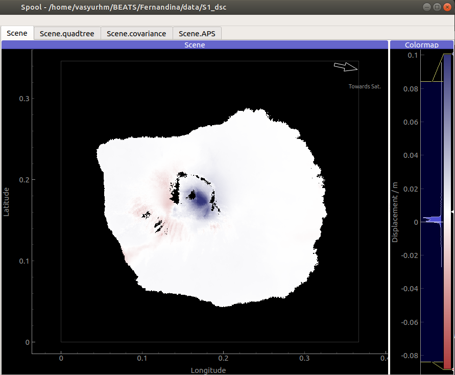
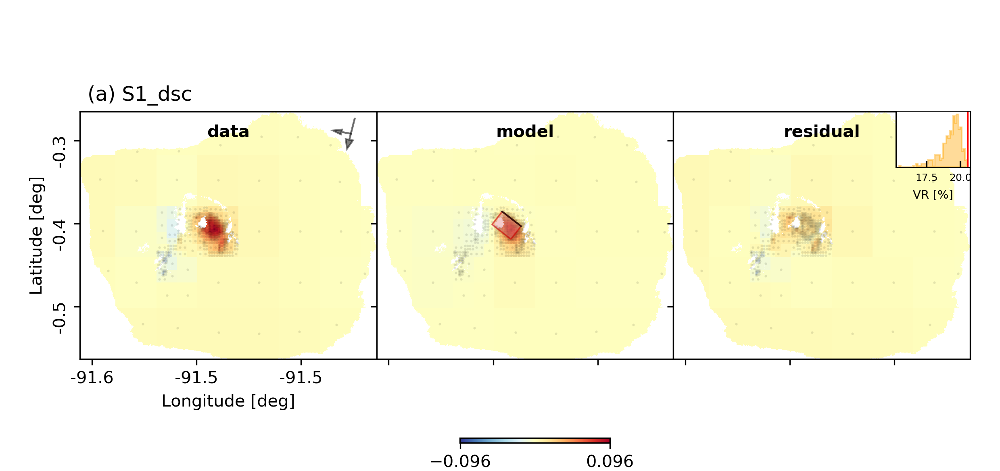
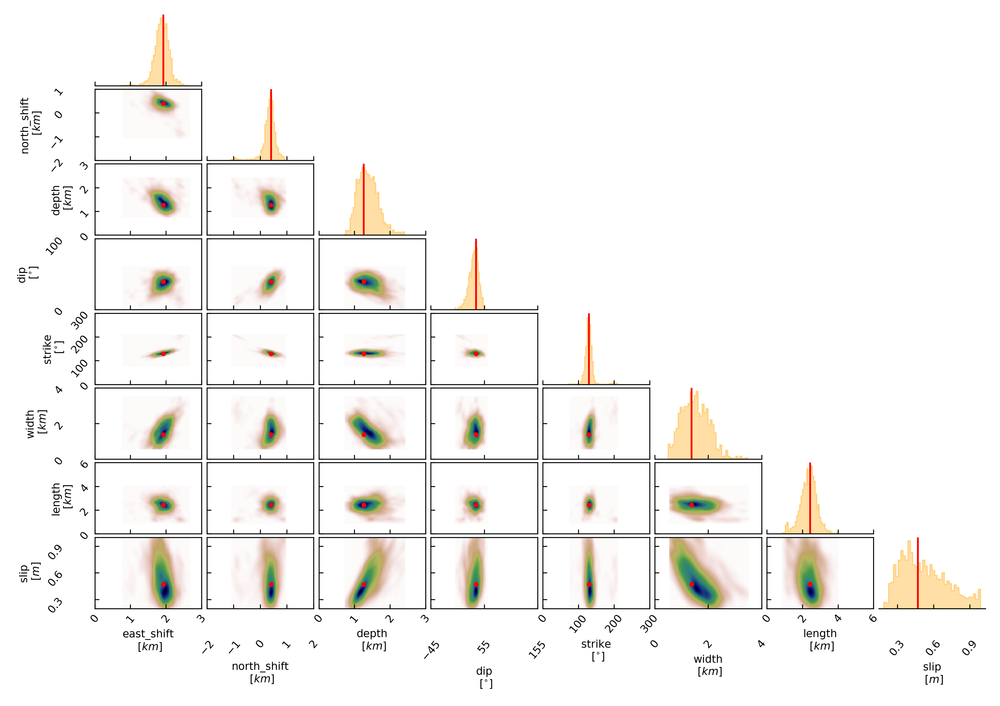

Example 6: Tensile Rectangular source
-------------------------------------
In this example we are going to model a magmatic intrusion with a tensile rectangular source.
The example `dataset <https://github.com/hvasbath/fernandina_kite_container>`__ is a velocity estimate from Fernandina
during the time Dec 2014 - June 2018 from one of the `examples <https://github.com/insarlab/MintPy/blob/main/docs/demo_dataset.md>`__ of the Mintpy software for InSAR time-series processing. The mean linear velocity shows an inflation signal of ca. 10cm/yr.

Clone project
^^^^^^^^^^^^^

To copy the example (including the data) to a directory outside of the package source directory, please edit the '&beat_models_path' and depending on which datatypes you want to use in the optimization fill the datatypes argument.::

   cd /path/to/beat/data/examples/
   beat clone Fernandina $beat_models_path/Fernandina --datatypes=geodetic --copy_data

This will create a BEAT project directory named 'Fernandina' with a configuration file (config_geometry.yaml) and an example dataset.
 - If your datatypes list included "geodetic" real time-series velocity data (geodetic_data.pkl) will be copied.

Please change to your &beat_models_path with::

   cd $beat_models_path

Calculate Greens Functions
^^^^^^^^^^^^^^^^^^^^^^^^^^
We need to calculate a Greens function (GF) store, as done in `Example 3 <https://hvasbath.github.io/beat/examples.html#calculate-greens-functions>`__
the earthquake Rectangular Source example.

In this case we will calculate a Greens Function store that holds static displacements. For this we will make use of the PSGRN/PSCMP [Wang2008]_ backend. You will need to install the respective executables if not done yet! Please follow this `link <https://hvasbath.github.io/beat/installation.html#greens-functions>`__ to do so.
Please also make sure to have the pyrocko version v2021.04.02 installed where the functionality for tensile rectangular
sources has been added.

Please open $project_directory/config_geometry.yaml with any text editor (e.g. vi) and search for: store_superdir.
The path specified here needs to be replaced with the path to where the GFs are supposed to be stored on your computer.
This directory is referred to as the $GF_path in the rest of the text. It is strongly recommended to use a separate directory
apart from the beat source directory. The statics Green's function stores are not very large, but could be re-used by several projects in the
future.

In the $project_path/config_geometry.yaml under geodetic_config we find the gf_config, which holds the major parameters for GF calculation::

  gf_config: !beat.GeodeticGFConfig
    store_superdir: /home/vasyurhm/BEATS/GF/Fernandina
    reference_model_idx: 0
    n_variations: [0, 1]
    earth_model_name: ak135-f-average.m
    nworkers: 4
    use_crust2: true
    replace_water: true
    source_depth_min: 0.0
    source_depth_max: 20.0
    source_depth_spacing: 0.25
    source_distance_radius: 100.0
    source_distance_spacing: 0.25
    error_depth: 0.1
    error_velocities: 0.1
    depth_limit_variation: 600.0
    code: psgrn
    sample_rate: 1.1574074074074073e-05
    sampling_interval: 1.0
    medium_depth_spacing: 1.0
    medium_distance_spacing: 10.0

To get a short explanation for each parameter please see the API modules `here <https://hvasbath.github.io/beat/api.html#config.NonlinearGFConfig>`__.

The variable 'store_superdir' needs to contain an **absolute path** to your $project_directory/.
You can also change the number of cores available to your system with the variable 'nworkers' to speed up the calculation of the GFs.
The GF grid spacing is important and can be modified in x,y direction with 'source_distance_spacing' and in depth with 'source_depth_spacing'.
The grid extent can be modified by 'source_distance_radius'. All the units are given in [km].

.. note:: Please keep the extent of the expected finite rectangular fault in mind! The source grid has to cover **always** the **complete** fault!. **Example**: For a fault with expected width between 10 - 15 km with, a dip of 70-90 degrees and an upper edge depth of 0-2. km; the depth grid of the GF store (including safety buffer) has to range from: 0. km to 17.5 km

The GF parameters for the Fernandina static example are good for now.::

   beat build_gfs Fernandina --datatypes=geodetic

This will create an empty Greens Function store named statics_ak135_0.000Hz_0 in the $GF_path. It will use the AK135 earth model [Kennet1995]_ in conjunction with the CRUST2.0 [Bassin2000]_ for the shallow layers (enabled use_crust2 flag above).
Under $GF_path/statics_ak135_0.000Hz_0/config the Green's Functions "config"-file could be further customized .

We can next build the Green's Functions with::

   beat build_gfs Fernandina --datatypes=geodetic --execute

This will take some time, depending on how much CPUs you specified to execute in parallel at 'nworkers'. However, this only has to be done once and the GF store can be reused for different examples if the velocity model does not differ between the different cases.

Optimization setup
^^^^^^^^^^^^^^^^^^
Before further setup we should check that the 'project_dir' variable in the main upper body of the $project_directory/config_geometry file is set correctly to your $project_directory/.
Please also take note of the 'event' variable, which is the location of Fernandina volcano in the `pyrocko <https://github.com/pyrocko/pyrocko>`__. event format.
The location and timing parameters of this event are used as the reference point in the setup of the local coordinate system.
We will explore the solution space of a tensile Rectangular Source [Okada1985]_ in an elastic homogeneously layered halfspace.

The parameters to explore are the sources east_shift, north_shift, depth, strike, dip, length, width and slip.
The unit for slip is [m] and for all the other length measures (length, width, depth etc...) it is [km]. The angles (strike and dip) are given in [degree].
The amount of tensile dislocation vs shear is controlled by the **opening_fraction** argument. Here, it is fixed to +1 for pure opening.
For pure closing it would need to be fixed to -1. For a mixed setup of shear and tensile dislocation the opening_fraction could be set to anything between plus and minus one where, zero is a pure shear dislocation. For pure tensile dislocation, the rake argument becomes meaningless, which is why it has been fixed to zero.::

   priors:
     rake: !beat.heart.Parameter
       name: rake
       form: Uniform
       lower: [0.0]
       upper: [0.0]
       testvalue: [0.0]

.. note:: The "testvalue" has to be within the upper and lower bounds!

However, for the Fernandina example we are now satisfied with the pre-set priors, in the config_geometry.yaml file.

The 'decimation_factor' variable controls how detailed the displacement from the source should be calculated.
High numbers allow for faster calculation through each forward calculation, but the accuracy will be lower.
The sub variable 'geodetic' controls the decimation for the geodetic data only.
For the Fernandina case we leave it at 2 for now.

Sample the solution space
^^^^^^^^^^^^^^^^^^^^^^^^^

Firstly, we only optimize for the noise scaling or hyperparameters (HPs)::

   beat sample Fernandina --hypers

Checking the $project_directory/config_geometry.yaml, the HPs parameter bounds show something like::

   hyperparameters:
   h_SAR: !beat.heart.Parameter
     name: h_SAR
     form: Uniform
     lower: [-1.0]
     upper: [5.0]
     testvalue: [2.0]

At this point the bounds could be relaxed again as well by manually editing the configuration file, or the step could be entirely skipped.
Now that we have an initial guess on the hyperparameters we can run the optimization using the default sampling algorithm, a Sequential Monte Carlo sampler.
The sampler can effectively exploit the parallel architecture of nowadays computers. The 'n_jobs' number should be set to as many CPUs as possible in the configuration file. As we have a fairly simple setup with only few parameters to be estimated we can use a low number of Markov Chains (n_chains).::

    sampler_config: !beat.SamplerConfig
      name: SMC
      backend: bin
      progressbar: true
      buffer_size: 5000
      buffer_thinning: 5
      parameters: !beat.SMCConfig
        tune_interval: 50
        check_bnd: true
        rm_flag: false
        n_jobs: 4
        n_steps: 300
        n_chains: 40
        coef_variation: 1.0
        stage: 0
        proposal_dist: MultivariateCauchy
        update_covariances: false

.. note:: 'n_chains' divided by 'n_jobs' MUST yield a whole number! An error is going to be thrown if this is not the case!

Dependend on the hardware, sampler specifications and number of jobs that have been defined, this calculation is going to take few hours.
Therefore, in order to avoid crashes or in the case of remote connection via ssh it is very much recommended to use software like 'screen'
to detach the terminal where the process is running. For now we do not do that, simply run::

    beat sample Fernandina

The sampling is successfully finished if the screen shows something like this::

    ...
    2021-03-03 12:58:33,749 - backend - INFO - Loading multitrace from /home/vasyurhm/BEATS/Fernandina/geometry/stage_15
    2021-03-03 12:58:33,768 - smc - INFO - Beta > 1.: 1.005489
    2021-03-03 12:58:33,769 - smc - INFO - Saving sampler state ...
    2021-03-03 12:58:33,771 - smc - INFO - Sample final stage with n_steps 300 
    2021-03-03 12:58:33,775 - sampler - INFO - Initialising 40 chain traces ...
    2021-03-03 12:58:33,783 - sampler - INFO - Serial time per sample: 0.349948
    2021-03-03 12:58:33,783 - sampler - INFO - Data to be memory shared: 
    2021-03-03 12:58:33,783 - sampler - INFO - No data to be memshared!
    2021-03-03 12:58:33,783 - sampler - INFO - Sampling ...
    2021-03-03 13:03:11,741 - parallel - INFO - 
     Feierabend! Done with the work!

.. note:: The reader might have noticed the two different *backends* that have been specified in the *SamplerConfigs*, "csv" and "bin". `Here <https://hvasbath.github.io/beat/getting_started/backends.html#sampling-backends>`__ we refer to the backend section that describe these further.

.. note::  For more detailed search of the solution space please modify the parameters 'n_steps' and 'n_chains' for the SMC sampler in the $project_directory/config_geometry.yaml file to higher numbers. Depending on these specifications and the available hardware the sampling may take several hours/few days.

Summarize and plotting
^^^^^^^^^^^^^^^^^^^^^^
The SMC sampler has several stages that would need to be summarized if their results is meant to be plotted.
To summarize only a specific stage please add the 'stage_number' option, e.g. the final stage -1::

    beat summarize Fernandina --stage_number=-1

.. note::
    Only for SMC:
    All the chain_*.csv/.bin files under the $project_directory/geometry/stage_* directories can be problematic for
    the operation system, e.g. on Clusters. Once a stage finished sampling these can be also deleted by setting the 'rm_flag'
    under the 'SamplerConfig.parameters'. The program will ask again once for safety reasons if the files are really supposed to be deleted. Once they are gone, they are gone! Restarting the sampling from that stage (see above) wont be possible anymore.

After that, several figures illustrating the results can be created. To do so the **kite** software needs to be installed and the original displacement data needs to be downloaded `here <https://github.com/hvasbath/fernandina_kite_container>`__. They need to be put into the specified data path given under "datadir" in the geodetic_config section of the configuration file.
For a comparison between data, synthetic displacements and residuals for the two InSAR tracks in a local coordinate system please run::

  beat plot Fernandina scene_fits --nensemble=300

The plot should show something like this. Here the residuals are displayed with an individual color scale according to their minimum and maximum values. The histogram in the upper right shows weighted variance reduction. The argument **nensemble** determines how many samples from the posterior should be drawn to plot that histogram.:

 .. image:: ../_static/example6/Fernandina_scenes_-1_max_local_300_0.png

For a plot using the global geographic coordinate system where the residuals have the same color bar as data and synthetics please run::

  beat plot Fernandina scene_fits --nensemble=300 --plot_projection=latlon

For a correlation plot of the parameter marginals please run::

  beat plot Fernandina correlation_hist --format=png --varnames=east_shift,north_shift,depth,length,width,strike,dip,rake,slip

The "varnames" argument determines the order of the plotted variables and which variable to plot.

These plots are stored under your Fernandina folder under geometry/figures.
