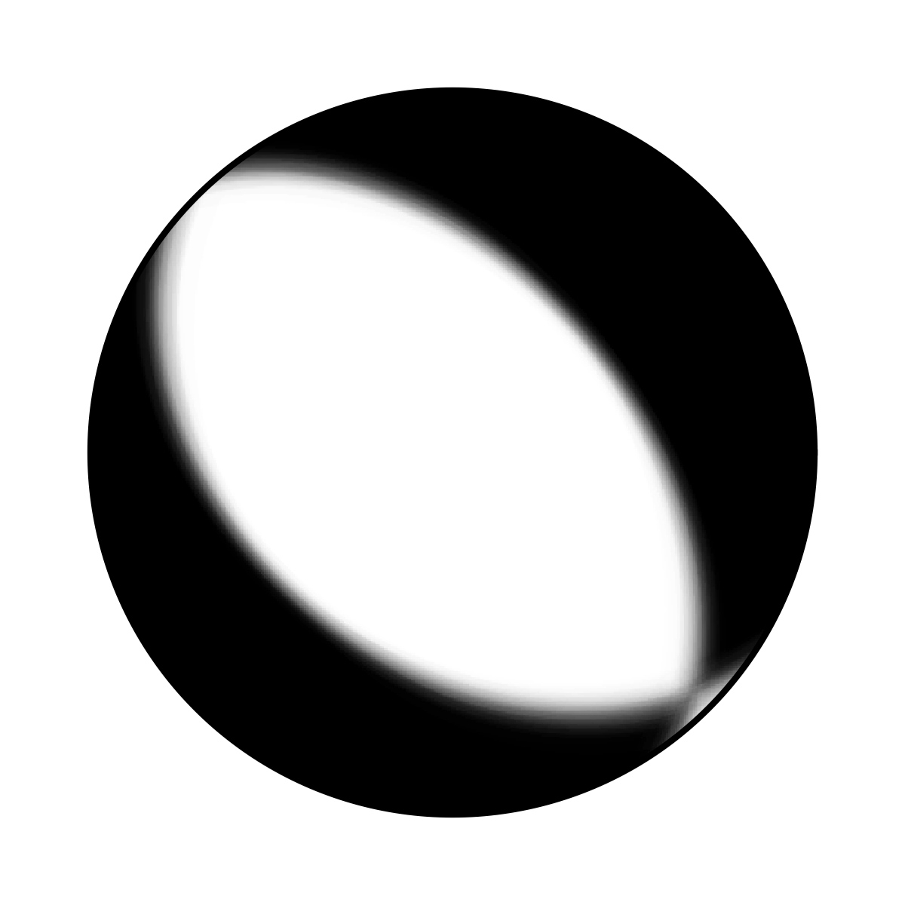

Example 5: Teleseismic Double Couple
--------------------------------------
Clone project
^^^^^^^^^^^^^
In this example we will use a real teleseismic dataset from the Mw6.3 2009 L'Aquila earthquake and sample the solution space of a Double Couple point source.
The dataset consists of 35 seismic stations within teleseismic distances (between 4000 and 10000 km) with respect to the origin of the reference event.
To copy the Example (including the data) to a directory outside of the package source directory, please edit the 'model path' (referred to as $beat_models now on) to your preference path and execute::

    cd /path/to/beat/data/examples/
    beat clone dc_teleseismic /'model path'/dc_teleseismic --copy_data --datatypes=seismic --source_type=DCSource

This will create a BEAT project directory named 'dc_teleseismic' with a configuration file (config_geometry.yaml) and real example data (seismic_data.pkl).
This directory is going to be referred to as '$project_directory' in the following.

We will assume that the reader is familiar with the setup of `Example 1 <https://hvasbath.github.io/beat/examples.html#calculate-greens-functions>`__ beforehand.

Download/Calculate Greens Functions
^^^^^^^^^^^^^^^^^^^^^^^^^^
For this example we will need a global Greens function store with a source-receiver setup suitable for teleseismic distances.
As such a global store can be potentially very memory expensive we will limit the possible source locations to a maximum depth of 25 km and limit the sampling rate to a sensible 0.5 Hz (or 2s) and the spatial sampling to 4 km in depth and distance.

We will download the needed Greens function store from the pyrocko project `Greens Mill repository <https://greens-mill.pyrocko.org/>`__ with the following commands::

  cd $GF_path
  fomosto download kinherd global_2s_25km

Please make sure that the store_superdir in the configuration file (config_geometry.yaml) is set to match your $GF_path.

  store_superdir: $GF_path

Alternatively we can also calculate the Greens function (GF) store ourselves, as done in `Example 1 <https://hvasbath.github.io/beat/examples.html#calculate-greens-functions>`__
the regional Full Moment Tensor example. The settings in the example configuration file (config_geometry.yaml) do not need to be changed and we could directly execute::

  beat build_gfs dc_teleseismic --datatypes='seismic'

Data windowing and optimization setup
^^^^^^^^^^^^^^^^^^^^^^^^^^^^^^^^^^^^^

The seismic phases filter and taper are defined under 'waveforms' in the $project_directory/config_geometry.yaml and will be in this example only the P phase ::

  - !beat.WaveformFitConfig
    include: true
    preprocess_data: true
    name: P
    channels: [Z]
    filterer: !beat.heart.Filter
      lower_corner: 0.01
      upper_corner: 0.2
      order: 4
    distances: [30.0, 90.0]
    interpolation: multilinear
    arrival_taper: !beat.heart.ArrivalTaper
      a: -15.0
      b: -10.0
      c: 40.0
      d: 55.0

In this case we want to optimize the entire P-phase up to 0.2 Hz, with a taper from 15s before to 55s after the P-wave onset.
Different filters and arrival time windows maybe defined as well. These parameters are all fine for this case here!
Please note that the downloaded (or calculated) Greens function store has a Nyquist frequency of 0.25 Hz and is only valid for sources up to 25 km depth.

For P-waves one would like to use the Z (vertical) component.

Seismic noise estimation
^^^^^^^^^^^^^^^^^^^^^^^^
As we deal with real data we have a poor knowledge of the noise in the data, the model parameter estimates may be poor and the true parameters are not covered by the distributions. We will estimate the noise using the seismic noise analyzer. Under the seismic_config you find the configuration for the noise analyzer, which looks like that::

  noise_estimator: !beat.SeismicNoiseAnalyserConfig
    structure: variance
    pre_arrival_time: 10.0

The "structure" argument refers to the structure of the covariance matrix that is estimated on the data, prior to the synthetic P-wave arrival. The argument "pre_arrival_time" refers to the time before the P-wave arrival. 3.0 means that the noise is estimated on each data trace up to 10. seconds before the synthetic P-wave arrival.
Other options are to "import" to use the covariance matrixes that have been imported with the data
Also the option "non-toeplitz" to estimate non-stationary, correlated noise on the residuals following [Dettmer2007]_.

Sample the solution space
^^^^^^^^^^^^^^^^^^^^^^^^^
As a first step we fix the source parameters to some random value and only optimize for the noise scaling or hyperparameters (HPs) of each individual trace. Bear in mind that the HPs are raised exponentially, so the values for the bounds should not be to broad. To also allow for downscaling the lower bound of the HPs has to be negative.
Checking the $project_directory/config_geometry.yaml, the HPs parameter bounds show something like::

     hyperparameters:
       h_any_P_0_Z: !beat.heart.Parameter
         name: h_any_P_0_Z
         form: Uniform
         lower: [-2.0]
         upper: [7.0]
         testvalue: [0.0]

The configuration of the hyper parameter sampling is determined by the hyper_sampler_config parameters.::

  hyper_sampler_config: !beat.SamplerConfig
    name: Metropolis
    backend: csv
    progressbar: true
    buffer_size: 5000
    buffer_thinning: 10
    parameters: !beat.MetropolisConfig
      tune_interval: 50
      proposal_dist: Normal
      check_bnd: true
      rm_flag: false
      n_jobs: 4
      n_steps: 25000
      n_chains: 12
      thin: 5
      burn: 0.5

 To start the sampling please run ::

    beat sample dc_teleseismic --hypers

Now that we have determined the noise scalings we want to sample the full problem. The sampler to be used can be configured under 'sampler_config'.::

  sampler_config: !beat.SamplerConfig
    name: SMC
    backend: bin
    progressbar: true
    buffer_size: 5000
    buffer_thinning: 50
    parameters: !beat.SMCConfig
      tune_interval: 10
      check_bnd: true
      rm_flag: false
      n_jobs: 4
      n_steps: 200
      n_chains: 1000
      coef_variation: 1.0
      stage: 19
      proposal_dist: MultivariateCauchy
      update_covariances: false

Here we use 4 cpus (n_jobs) - you can change this according to your systems specifications.
Finally, we sample the solution space with::

    beat sample dc_teleseismic

Summarize the results
^^^^^^^^^^^^^^^^^^^^^
The sampled chain results of the PT sampler are stored in separate files and have to be summarized.

To summarize all the stages of the sampler please run the summarize command.::

    beat summarize dc_teleseismic

If the final stage is included in the stages to be summarized also a summary file with the posterior quantiles will be created.
If you check the summary.txt file (path then also printed to the screen)::

    vi $project_directory/geometry/summary.txt

Plotting
^^^^^^^^
To see the waveform fit of the posterior maximum likelihood solution run in the $beat_models folder::

    beat plot dc_teleseismic waveform_fits --nensemble=100

It will produce a pdf with several pages output for all the components for each station that have been used in the optimization.
The black waveforms are the unfiltered data. The plot shows the synthetic traces from the 100 best fitting models, in yellow to red colors, with the color indicating the density. The yellowish background indicates the taper.
The Z-components from our stations should look something like this.

  .. image:: ../_static/example5/dc_teleseismic_waveforms_100_0.png

The following command produces a '.png' file with the final posterior distribution. In the $beat_models run::

    beat plot dc_teleseismic stage_posteriors --reference --stage_number=-1 --format='png'

It may look like this.

 .. image:: ../_static/example5/dc_teleseismic_stage_-1_max.png

 The vertical black lines are the true values and the vertical red lines are the maximum likelihood values.

 To get an image of parameter correlations (including the true reference value in red) run in $beat_models::

    beat plot dc_teleseismic correlation_hist --reference --stage_number=-1 --format='png'

This will show an image like that.

 .. image:: ../_static/example5/dc_teleseismic_corr_hist_max.png

This shows 2d kernel density estimates (kde) and histograms of the specified model parameters. The darker the 2d kde the higher the probability of the model parameter.
The red dot and the vertical red lines show the true values of the target source in the kde plots and histograms, respectively.

To get an image of solution ensemble as a fuzzy beachball run in $beat_models::

   beat plot dc_teleseismic fuzzy_beachball --stage_number=-1 --nensemble=200 --format='png'

This will show an image of the 200 best solutions as beachballs, with the the color intensity indicating the model density.

References
^^^^^^^^^^
.. [Dettmer2007] Dettmer, Jan and Dosso, Stan E. and Holland, Charles W., Uncertainty estimation in seismo-acoustic reflection travel time inversion, The Journal of the Acoustical Society of America, DOI:10.1121/1.2736514
